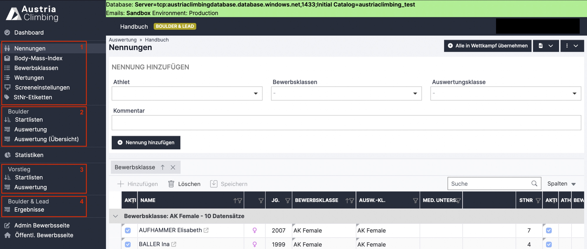

# Bewerb auswerten: Boulder\&Lead

In diesem Kapitel wird das Auswertungsprogramm zur Auswertung eines Boulder\&Lead Wettkampfs erklärt. Für die Disziplin Boulder\&Lead müssen einige Schritte zweimal (einmal je Einzeldisziplin) durchgeführt werden. Die entsprechende Auswertungsoberfläche ist in folgender Abbildung dargestellt:

<figure><figcaption>
Auswerteroberfläche Boulder&#x26;Lead
</figcaption></figure>

&#x20;Einstellungen, die für den gesamten Bewerb getroffen werden, sind einmal als Register vorhanden (rotes Kästchen 1). Die Startlisten der Boulderrunden (rotes Kästchen 2) sind getrennt von den Leadrunden (rotes Kästchen 3) zu erstellen und die Ergebnisse werden auch getrennt in den Registern Auswertung eingetragen.  Das kombinierte Ergebnis für Boulder\&Lead kann im Register „Ergebnisse“ (rotes Kästchen 4) angesehen und heruntergeladen werden. Ergebnisse können jedoch nur in den Einzeldisziplinen bearbeitet werden.

**Achtung:** Wie bereits beschrieben ist aktuell (02/2024) nur die Auswertung eines Boulder & Lead Bewerbs im olympischen Format (lt. IFSC Rules) möglich, also mit 4 Bouldern und 1 Route pro Runde.
