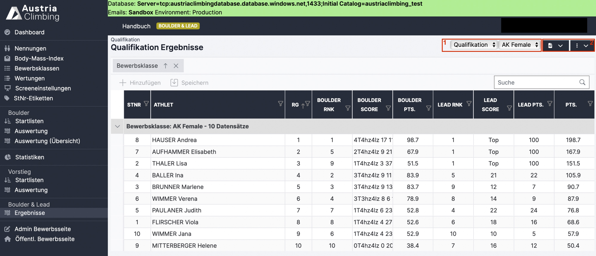

# Ergebniserstellung Register "Ergebnisse" (Boulder\&Lead)

Im Register „Ergebnisse“ der Auswerteroberfläche können die Ergebnisse der Einzeldisziplinen sowie der Gesamtpunkte eingesehen und heruntergeladen werden.&#x20;

<figure><figcaption>
Register "Ergebnisse" der Auswerteroberfläche
</figcaption></figure>

&#x20;

#### In den zwei grau hinterlegten Dropdown-Menüs (rotes Kästchen 1) wird ausgewählt, was angezeigt werden soll. Man wählt&#x20;

* Die entsprechende Runde (Qualifikation, Semifinale, Finale)
* Die Bewerbsklasse. Es kann entweder eine einzelne Klasse oder „Alle“ ausgewählt werden. Bei „Alle“ werden alle Bewerbsklassen untereinander angezeigt.

#### Im dunkelblauen Dropdown-Menü mit dem PDF-Symbol (rotes Kästchen 2) können folgende Ergebnislisten heruntergeladen werden:

*   Rundenergebnis PDF

    * Ergebnis der (im grauen Dropdown-Menü ausgewählten) Runde und Bewerbsklasse
    * Sind alle Bewerbsklassen ausgewählt, wird ein Dokument mit den Ergebnissen jeder Bewerbsklasse auf einer eigenen Seite erstellt&#x20;
    * Punkte der einzelnen Disziplinen und Gesamtpunkte sind angegeben
    * Ist eine bereits im Register „Bewerbsklassen“ eine Quote für die nächste Runde (Semifinale oder Finale) eingetragen, so werden die für die nächste Runde qualifizierten Athleten\*innen mit einem schwarzen Strich von den nichtqualifizierten Athleten\*innen getrennt

*   Gesamtergebnis PDF

    * Gesamtergebnis der (im grauen Dropdown-Menü ausgewählten) Bewerbsklasse
    * Sind alle Bewerbsklassen ausgewählt, wird ein Dokument mit den Ergebnissen jeder Bewerbsklasse auf einer eigenen Seite erstellt
    * Es werden die Punkte (Boulder- & Leadpunkte) aller gekletterten Runden angegeben
    * Bei Status „Läuft“ oder „Inoffizielles Ergebnis“ der Bewerbsklasse (oder bei „Alle“ zumindest bei einer Bewerbsklasse), steht im Titel des Gesamtergebnis-PDFs „Inoffizielles Ergebnis“
    * Bei Status „Offizielles Ergebnis“ der Bewerbsklasse (oder bei „Alle“ bei allen Bewerbsklassen) ist der Titel im Dokument „Offizielles Ergebnis“

*   Gesamtergebnis XLSX

    * Gesamtergebnis wie in Gesamtergebnis PDF beschrieben als XLSX-Datei. Achtung: 2 Tabellenblätter, Detailergebnisse sind auf Blatt 2

#### Im dunkelblauen Dropdown-Menü mit den drei senkrechten Punkten (rotes Kästchen 2) können folgende Aktionen ausgeführt werden:

* Aktualisieren
* Live Results senden

#### In der Tabelle werden die Wertungen, Punkte und Rang der einzelnen Disziplinen sowie die Gesamtpunkte und der entsprechende Rang angegeben.

Änderungen der Wertungen können nicht vorgenommen werden (nur in den Registern „Auswertung“ der Einzeldisziplinen möglich)
