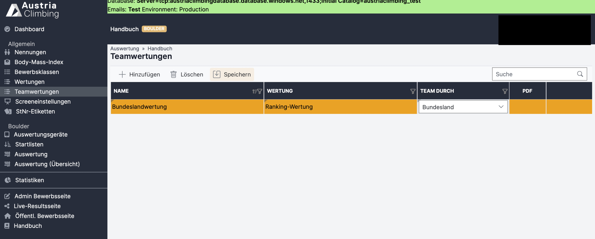
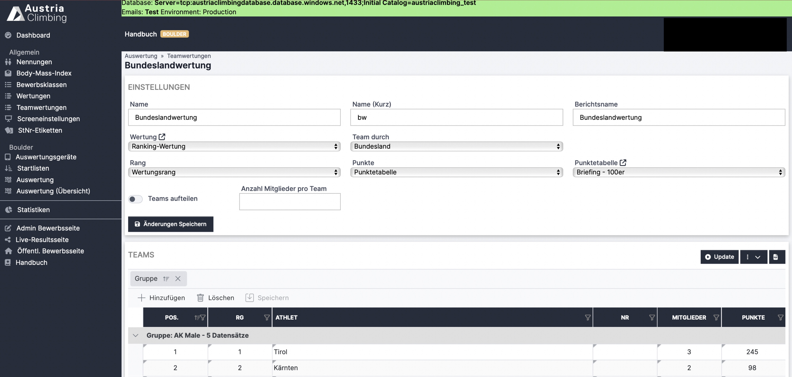

# Teamwertung

WICHTIG: Um eine Teamwertung anlegen zu können, muss nicht unbedingt in der Admin Bewerbsoberfläche unter "Bearbeiten" der Haken "Team" aktiviert sein. Dieser ist nur dann nötig, wenn es für die Durchführung des Bewerbs Teams mit Teamnamen geben soll, statt die Teilnehmer:innen nach Charakteristika wie z.B. Verein oder Bundesland zu gruppieren. Andernfalls kann A) übersprungen und nur B) durchgeführt werden.

### **A) Teamwettkampf (z.B. Schulbouldercup):**

Nachdem in der Bewerbsoberfläche der Haken "Team" aktiviert wurde, ist in der Auswertungsoberfläche unter Nennungen eine zusätzliche Spalte für die Teamnamen ersichtlich. Die Teamnamen können einfach in der Tabelle eingegeben werden. Achtet dabei auf die exakte Schreibweise! Athlet:innen können nur dann den Teams zugeordnet werden, wenn die Teamnamen genau gleich geschrieben sind.

Im Beispiel unten wurden die Athlet:innen in Teams je nach Schule zugeordnet. Die Namen der Schulen wurden als Teamnamen in der Nennungs-Tabelle eingetragen.

<figure><figcaption></figcaption></figure>

Die Auswertung des Wettkampfes findet nun genau so statt, wie bei einem herkömmlichen Boulderbewerb. Die Scores werden pro Athlet:in eingetragen, erst zum Schluss kann eine Wertung nach Teams erstellt werden. Siehe B)

### **B) Teamwertung:**

**Jeder Teamwertung liegt eine Wertung zu Grunde! Es muss also jedenfalls auch eine Wertung erstellt werden, um eine Teamwertung erstellen zu können.**

Im Register „Teamwertungen“ der Auswerteroberfläche können die Athlet:innen in Teams zusammengefasst werden und ein Ranking der Teams erstellt werden. Somit wird unter anderem ermöglicht die beste Sektion / das beste Bundesland schnell zu ermitteln. Das entsprechende Ergebnis PDF kann direkt im Register „Teamwertungen" (wird im Folgenden erklärt) geöffnet werden.

* Mit Klick auf **„Hinzufügen“** erscheint eine neue Zeile
* In der Spalte **„Name“** den Namen für die Teamwertung eingeben
* In der Spalte **„Wertung“** die Wertung auswählen aus der die Teamwertung berechnet werden soll. Die Wertung muss im vorhinein im Register "Wertungen" erstellt werden. Selbst wenn der komplette Bewerb für die Teamwertung herangezogen werden soll muss eine Wertung erstellt werden (in dieser kann dann einfach nach Bewerbsklassen gruppiert werden dann ist das Ergebnis dasselbe wie das Ergebnis in "Auswertung").
* In der Spalte **„Team durch“** auswählen durch was die Teams zusammengesetzt werden. Die Möglichkeiten sind: Verein, Bundesland, Land, Gender, Team
  * bei der Auswahl des Filters "Team" wird auf individuell vergebene Teamnamen zurückgegriffen --> Siehe A)
* Auf **„Speichern“** klicken

Nach dem Speichern erscheinen rechts zwei neue Button.

* Mit Klick auf das **PDF Symbol** öffnet sich ein PDF mit den, entsprechend den getroffenen Einstellungen, gefiltertem/gruppierten Ergebnis
* Mit Klick auf den **Pfeil** öffnet man das Fenster, in dem die weiteren Einstellungen für die entsprechende Teamwertungen getroffen werden

<figure><figcaption>
Auswertungsoberfläche Register "Teamwertungen" neue Wertung hinzufügen
</figcaption></figure>

#### Einstellungen gefilterte Wertungen

Nach Klick auf den Pfeil öffnet sich die im folgenden abgebildete Seite.

<figure><figcaption>
Einstellungen des Registers "Wertungen" der Auswertungsoberfläche
</figcaption></figure>

* Im oberen Feld können noch einige Einstellungen gemacht werden. Die Felder "Name", "Wertung" und "Team durch" werden dabei aus der Tabellenzeile der vorherigen Seite übernommen, können aber geändert werden.
* Im Feld "Rang" kann ausgewählt werden zwischen "Bewerbsrang" und "Wertungsrang". Bei "Bewerbsrang" werden die Punkte entsprechend des erzielten Rangs bei dem Bewerb vergeben. Bei "Wertungsrang" wird nur unter den Teilnehmer:innen die für das Ranking herangezogen werden eine Art "internes Ranking" erstellt und anhand dessen die Punkte vergeben.
* Im Feld "Punkte" kann ausgwählt werden ob nach einer Punktetabelle (und somit nach Punkten per Rang) oder nach Bewerbspunkten die Punkte vergeben und für die Teams addiert werden.
* Im Feld "Punktetabelle" wird ausgewählt nach welcher Tabelle die Rangpunkte vergeben werden
* Es kann eine Anzahl an Mitglieder pro Team gewählt werden und somit die Teams untereinander aufgeteilt werden

Mit Klick auf "Update" werden die Athlet:innen in die Teams aufgeteilt, die Punkte vergeben und das Ergebnis in der untenstehenden Tabelle und im PDF dargestellt.

### Beispiel für eine Teamwertung mit Teams durch Bundesländer

Auf Grund der Quoten-Regelung für die Startplätze bei der ÖM U13 (siehe Österreichische Bestimmungen 5.7.1.) müssen Bundesländer-Rankings aus den ÖM U13 Bewerben Boulder und Lead erstellt werden. Die Erklärung & Screenshots unten beschreiben die Erstellung der Teamwertung nach Bundesländern bei der ÖM U13 Boulder 2025 - diese Wertung bildet die Grundlage für die Startquoten bie der ÖM U13 Boulder 2026.

1. Die ÖM Boulder U13 wurde wie üblich ausgewertet, die Teamwertung wurde im Nachhinein erstellt
2. Wertung: Da der Teamwertung eine Wertung zu Grunde liegen muss, wurde eine Wertung erstellt mit Gruppierung nach Bewerbsklassen, somit wird das Ergebnis nicht verändert.

<figure><figcaption>
Wertung als Grundlage für die Teamwertung
</figcaption></figure>

3. Teamwertung: Eine Teamwertung wird angelegt und die in Punkt 2. erstellte Wertung damit verknüpft. Die Teamwertung wird wie folgt eingestellt:
   1. Team durch Bundesland
   2. Rang: In diesem Fall irrelevant ob Bewerbsrang oder Wertungsrang, weil diese sich nicht unterscheiden
   3. Anzahl Mitglieder pro Team: 5 (lt. Österr. Bestimmungen)

<figure><figcaption></figcaption></figure>

4. Durch klicken auf "Update" werden die Ränge und Punkte eingetragen und die Teamwertung berechnet. Das Ergebnis sieht wie folgt aus und kann über das PDF Symbol direkt heruntergeladen werden.

<figure><figcaption></figcaption></figure>
