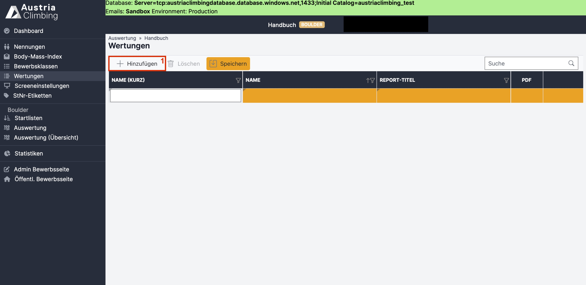
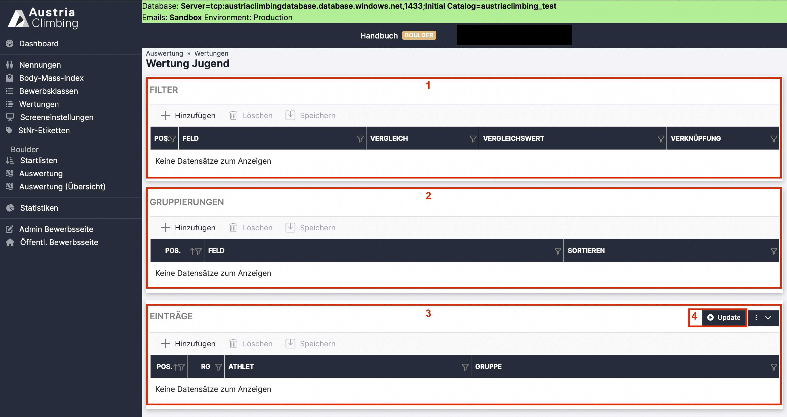
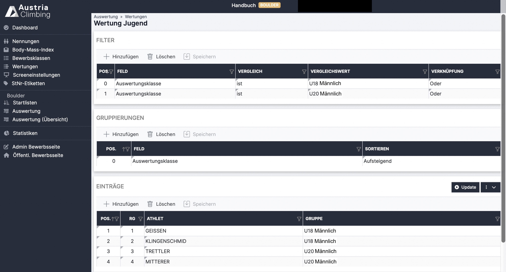

# Wertungen

Im Register „Wertungen“ der Auswerteroberfläche können gefilterte Ergebnisse, wie zum Beispiel nach der Auswertungsklasse oder nach Bundesländern, erstellt werden. Das entsprechende Ergebnis PDF kann entweder direkt im Register „Wertungen" (wird im Folgenden erklärt) oder auch im Register „Auswertung“, bei Klick auf das PDF Symbol und Auswahl des entsprechenden Ergebnisses, geöffnet werden.

<figure><figcaption>
Auswertungsoberfläche Register "Wertungen" neue Wertung hinzufügen
</figcaption></figure>

* Mit Klick auf **„Hinzufügen“** (rotes Kästchen 1) erscheint eine neue, grau hinterlegte, Zeile
* In der Spalte **„Name (Kurz)“** den Namen für die Wertung eingeben der im Auswertungsprogramm als „Kürzel“ verwendet wird (zB bei der Bezeichung des PDF Buttons)
* In der Spalte **„Namen“** den entsprechenden Namen für die Wertung eingeben, dieser wird so im Auswertungsprogramm verwendet
* In der Spalte **„Report-Title“** den Namen der Wertung eingeben der auf den PDF Ergebnislisten stehen soll
* Auf **„Speichern“** klicken

Nach dem Speichern erscheinen rechts zwei neue Buttons.

<figure><figcaption></figcaption></figure>

* Mit Klick auf das **PDF Symbol** öffnet sich ein PDF mit den, entsprechend den getroffenen Einstellungen, gefiltertem/gruppierten Ergebnis
* Mit Klick auf den **Pfeil** öffnet man das Fenster, in dem die Einstellungen für die entsprechenden gefilterte Wertungen getroffen werden

### Einstellungen gefilterte Wertungen

Nach Klick auf den Pfeil öffnet sich die im folgenden abgebildete Seite.

<figure><figcaption>
Einstellungen des Registers "Wertungen" der Auswertungsoberfläche
</figcaption></figure>

#### Gruppierungen

In der Tabelle „Gruppierungen“ (rotes Kästchen 2) wird ausgewählt nach welchem Kriterium die Athleten gruppiert werden sollen.

* Im „normalen“ Ergebnis wird immer nach Bewerbsklassen gruppiert, hier kann zusätzlich noch nach „Auswertungsklasse“, „Bundesland“, „Land“ und „Verein“ gruppiert werden.
* Mit Klick auf „Hinzufügen“ kann eine neue Gruppierung hinzugefügt werden
* Mit Klick auf „Speichern“ wird die Auswahl gespeichert
* Wählt man zum Beispiel „Bundesland“ aus, so werden alle Athlet\*innen desselben Bundeslands, unabhängig von ihrer Bewerbsklasse, in eine Gruppe gegeben und nach ihren Ergebnissen gereiht
* Wählt man „Auswertungsklasse“ aus, so werden alle Athlet\*innen nach ihrer Auswertungsklasse gruppiert und in ihrer Auswertungsklasse gereiht. Ein Beispiel wie diese Wertung im Ergebnis-PDF aussieht ist im folgenden gegeben.

<figure><figcaption>
Ergebnis der Wertung nach Auswertungsklassen
</figcaption></figure>

* Möchte man, dass die Athlet\*innen innerhalb ihrer Auswertungsklasse nach Bundesländern gereiht werden, muss man zwei Gruppierungen hinzufügen

<figure><figcaption></figcaption></figure>

* Zusätzlich kann noch eingestellt werden ob „Aufsteigend“ oder „Absteigend“ sortiert werden soll
* Um Gruppierungen zu löschen die entsprechende Zeile auswählen und auf „Löschen“ klicken

#### Filter

In der Tabelle „Filter“ (rotes Kästchen 1) können die ausgewählten Gruppierungen noch weiter gefiltert werden.

* Mit Klick auf „Hinzufügen“ kann ein neuer Filter erstellt werden
* In der Spalte „Feld“ kann mittels Dropdown-Menü ausgewählt werden was gefiltert werden soll. Man kann „Alter“, „Auswertungsklasse“, „Bewerbsklasse“, „Bundesland“, „Land“, „Verein“ und „Jahrgang“ auswählen
* In der Spalte „Vergleich“ wird die logische Bedingung des Filters ausgewählt. Man kann im Dropdown-Menü zwischen „größer“, „größer oder gleich“, „ist“, „ist nicht“, „kleiner“ und „kleiner oder gleich“ wählen.
* In der Spalte „Vergleichswert“ muss eingegeben werden welchen Wert das „Feld“ haben soll bzw. nicht haben soll (bei „ist nicht“). Achtung: der Vergleichswert muss exakt eingegeben werden und muss ausgeschrieben werden: z.B. „U16 Männlich“ oder „Steiermark“, nicht „STMK“. Die genauen Bezeichnungen die für die Vergleichswerte zur Auswahl stehen sind ganz oben in dem Feld "Info" aufgeführt und können von dort kopiert werden.
* In der Spalte „Verknüpfung“ können mehrere Filter miteinander logisch verknüpft werden. Man kann auswählen zwischen „Oder“ und „Und“.
* Mit Klick auf „Speichern“ wird der eingestellte Filter gespeichert
* Um Filter zu löschen die entsprechende Zeile auswählen und auf „Löschen“ klicken

#### Einträge

In der Tabelle „Einträge“ (rotes Kästchen 3) werden, nach einstellen des Filters und der Gruppierung, die entsprechenden Athlet\*innen in die Tabelle geladen.

* Button „Upload“ (rotes Kästchen 4) klicken um die entsprechenden Athleten\*innen in die Tabelle zu laden
* Mit Klick auf „Hinzufügen“ können einzelne Athlet\*innen eigenhändig hinzugefügt werden
* Um Athlet\*innen aus der Wertung zu löschen die entsprechenden Zeilen auswählen und auf „Löschen“ klicken

#### Beispiel

Der Bewerb wird mit der Bewerbsklasse „AK Männlich“ durchgeführt, man möchte nun eine reine Nachwuchswertung der Nachwuchsklassen (U18 Männlich und U20 Männlich) erstellen. Die Athleten wurden in der Registrierung den Auswertungsklassen (U18 Männlich, U20 Männlich und AK Männlich) zugeteilt.

* Neue „Gruppierungen“ hinzufügen: Felds „Auswertungsklasse“ und „Aufsteigend“ sortieren
* Nun würde das Ergebnis wie in Abbildung 36 aussehen
* Man möchte jedoch nur U18 Männlich und U20 Männlich haben, da es ja nur um die Nachwuchswertung geht.
* Neue „Filter“ hinzufügen
* Mit Button „Upload“ die entsprechenden Athleten in die Tabelle laden

Alle Einstellungen dieses Beispiels sind in folgender Abbildung dargestellt.

<figure><figcaption>
Auswerteroberfläche Register "Wertungen" Beispiel Nachwuchswertung
</figcaption></figure>
