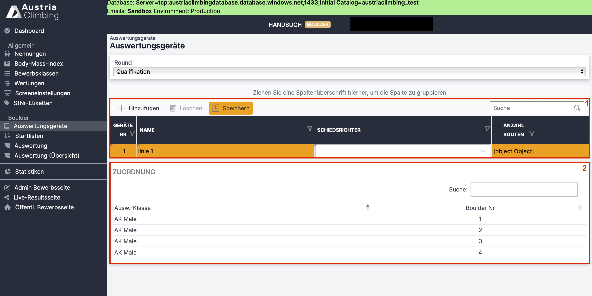

# Auswertungsgeräte - Live Scoring (Boulder)

Die Ergebniseingabe für Schiedsrichter:innen kann so eingestellt werden, dass jedem Auswertungsgerät fixe Boulder und Klassen zugewiesen werden können und diese nicht veränderbar sind. Das ist einerseits fehlervermeidend, da ein überschreiben ausgeschlossen wird, andereseits auch sehr nützlich wenn ein:e Schiedsrichter:in in einem Boulderjam mehrere Boulder zu judgen hat. Mit dieser Einstellung muss man nicht selbst die Boulder wechseln, sondern bekommt nur die Boulder seiner Linie angezeigt. Das ist auch möglich wenn der/die Schiedsrichter:in Boulder verschiedener Klassen gleichzeitig zu judgen hat.

Diese spezielle Schiedsrichteroberfläche kann in der Auswerteroberfläche im Register "Auswertungsgeräte" erstellt werden. Zu Beginn sieht dieses Register wie in der folgenden Abbildung aus.

<figure><figcaption>
Register Auswertungsgeräte
</figcaption></figure>

#### Im Dropdown-Menü "Round" wird die Bewerbsrunde ausgewählt (Qualifikation, Semifinale, Finale).

#### In der Tabelle (rotes Kästchen 1) werden die einzelnen Auswertungsgeräte hinzugefügt.

* Mit Klick auf **"Hinzufügen"** erscheint eine neue Zeile
* **Geräte Nr:** Nummerierung des Auswertungsgeräts
* **Name:** Name des Auswertungsgeräts
* **Schiedsrichter:** Im Dropdown-Menü kann ein:e Schiedsrichter:in dem Gerät zugewiesen werden. Das ist jedoch nur möglich wenn diese:r Schiedsrichter:in in der Adminoberfläche im Register "Staff" als Schiedsrichter\*in zum Bewerb hinzugefügt wurde. Alternativ, sollte kein:e Schiedsrichter:in dem Bewerb hinzugefügt sein, kann "-" ausgewählt werden.
* **Anzahl Routen:** Kein Eingabefeld. Hier steht danach wieviele Boulder dem Gerät zugewiesen wurden.
* Mit Klick auf **"Speichern"** wird die Eingabe gespeichert und es erscheint ein **Pfeil** in der rechten Zelle.

#### Im Feld "Zuordnung" (rotes Kästchen 2) sind alle Boulder aller stattfindenen Bewerbsklassen der ausgewählten Runde aufgelistet.

* Zu Beginn stehen alle Boulder aller Auswertungsklassen in einer Tabelle untereinander
* Sobald ein Auswertunsgerät hinzugefügt und Boulder zugewiesen wurden ist dies in einer zusätzlichen Spalte erkennbar (siehe letztes Bild dieser Page)

#### Mit Klick auf den Pfeil in der Zeile des Auswertungsgeräts öffnet sich ein neues Fenster in dem dem Auswertungsgerät die entsprechenden Boulder zugewiesen werden können.

<figure><figcaption>
Boulderzuweisung Auswertungsgeräte
</figcaption></figure>

* Links oben (rotes Kästchen 1) steht die Gerätnummer ("1") und der Name ("linie 1") des aktuell ausgewählten Auswertungsgerät
* Mit Klick auf **"Hinzufügen"** erscheint eine neue Zeile.
* In der Spalte **"Bewerbsklasse"** die entsprechende Bewerbsklasse auswählen
* In der Spalte **"Boulder Nr."** die entsprechende Bouldernummer auswählen
* In dem Beispiel der obrigen Abbildung wurden dem Gerät "linie 1" die Boulder 1 und 4 der Bewerbsklasse AK Male zugewiesen
* **Orange hinterlegt** sind alle Einträge die noch nicht gespeichert wurden
* Mit Klick auf **"Zurück zur Übersicht"** kommt man wieder zu der Ausgangsansicht

#### Sind alle Boulder den Auswertungsgeräten zugeordnet sieht dies wie folgt aus:

<figure><figcaption>
Auswertungsgeräte hinzugefügt
</figcaption></figure>

In diesem Beispiel werden drei Auwertungsgeräte verwendet.

* Gerät Nr 1 / Linie 1
  * Diesem Gerät ist "Gasser Lena" als Schiedsrichterin zugeteilt
  * 2 Boulder wurden dem Gerät zugewiesen: Boulder 1 und Boulder 4 der Klasse AK Male
* Gerät Nr 2 / Linie 2
  * Diesem Gerät wurde kein Schiedsrichter zugewiesen
  * Boulder 2 der Klasse AK Male wird mit diesem Gerät geschiedsrichtert
* Gerät Nr 3 / Linie 3
  * Diesem Gerät wurde kein Schiedsrichter zugewiesen
  * Mit diesem Gerät wird Boulder 3 der Klasse AK Male geschiedsrichtert

**Mit Klick auf den Button mit dem Tabletsymbol und dem Gerätnamen (rotes Kästchen 1) öffnet sich der QR-Code für das jeweilige Auswertungsgerät.**
