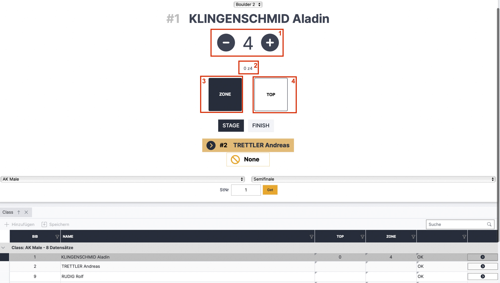
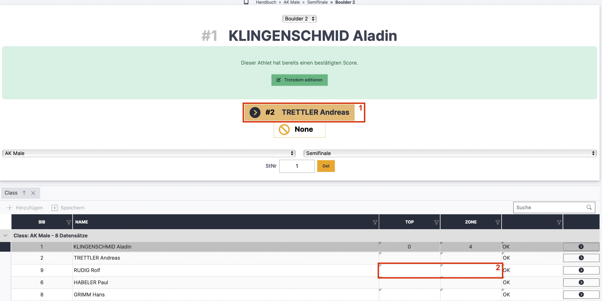

# Schiedsrichteroberfläche / Live Scoring (Boulder)

Die Ergebniseingabe für Schiedsrichter\*innen kann über das Register „Auswertung“ in der Auswerteroberfläche geöffnet werden. Dazu das dunkelblaue Dropdown-Menü mit den drei Punkten anklicken und „Live Scoring“ auswählen. Der erscheinende QR-Code kann dann von anderen Endgeräten gescannt werden und öffnet so direkt die Schiedsrichteroberfläche, eine Anmeldung im System ist nicht nötig.&#x20;

Alle Wertungen die vom Schiedsrichter über die LiveScoring Oberfläche eingetragen werden sind automatisch im LiveResults (online im Kalender bzw Screenanzeige) sichtbar. Im Backend/Auswertungsoberfläche muss man die Seite neu laden um die aktuellen Ergebnisse zu sehen. \
Außnahme: Im Format Boulderjam werden keine Liveergebnisse online bzw am Screen angezeigt. Dies passiert automatisch wenn der richtige Durchführungsmodus (Jam) ausgewählt wurde.

Beim ersten Öffnen sieht die Oberfläche wie folgt aus:

<figure><figcaption>
Live Scoring nach öffnen des QR-Codes
</figcaption></figure>

* Der Boulder, die Runde und die Bewerbsklasse kann über die grauen Dropdown-Menüs geändert werden
* Mit Klick auf den großen gelben Button (rotes Kästchen 1) öffnet sich die Eingabeoberfläche für den, nach festgelegter Startreihenfolge, ersten Athleten
* Über das Startnummernfeld (rotes Kästchen 2) kann die Eingabeoberfläche für jede/n Athlet\*in / Startnummer aufgerufen werden. Dazu die Startnummer in das Feld eingeben und auf den Button „Get“ klicken.
* Über den Pfeil rechts (rotes Kästchen 3) in der Tabelle kann die Eingabeoberfläche des / der Athleten\*in der jeweiligen Zeile geöffnet werden

Ist die Eingabeoberfläche eines / einer Athleten\*in ausgewählt verändert sich die Oberfläche zu:

<figure><figcaption></figcaption></figure>

* Klick auf **„Stage“** wenn der / die Athlet\*in den Boulder erreicht und die Kletterzeit beginnt&#x20;
* Mit dem **Plus und Minus** Button (rotes Kästchen 1) werden die Versuche gezählt, der aktuelle Versuch steht als Zahl zwischen den Buttons
* **Top und Zone** sind als ON/OFF Button dargestellt.&#x20;
  * „OFF“ (rotes Kästchen 4) ist so lange eingestellt bis der Athlet\*in eine Wertung (Zone oder Top) erzielt
  * “ON” (rotes Kästchen 3) wird geklickt, wenn der Athlet\*in im aktuellen Versuch Zone/Top erreicht hat
  * Ist die Zone einmal erreicht und auf „ON“ gestellt bleibt es auch bei den weiteren Versuchen auf „ON“, auch wenn der Athlet\*in die Zone nicht mehr erreicht hat (nicht selbst auf „OFF“ stellen wird in einem späteren Versuch die Zone nicht erreicht, sonst wird das vorherige Erreichen der Zone überschrieben/gelöscht)
* In der Mitte (rotes Kästchen 2) steht der **aktuelle Score**
* Die Wertungseingaben (Versuche, Zone, Top) werden **automatisch gespeichert** und sind direkt im Liveergebnis sichtbar
* Der / die aktuelle Athlet\*in wird in der Tabelle grau hinterlegt angezeigt und der Livescore steht in den entsprechenden Zellen&#x20;
* Klick auf **„Finish“** wenn der / die Athlet\*in mit dem Boulder fertig ist. Das Ergebnis wird gesperrt und die Oberfläche ändert sich zu der folgenden Abbildung. Bei Boulderjam „Finish“ erst klicken wenn der / die Athlet\*in nicht mehr zu dem Boulder kommen kann (Top geklettert, keine Versuche mehr bei limitierter Versuchszahl,…).

Nach Klick auf „Finish“ ist die Eingabeoberfläche des jeweiligen Athleten\*in gesperrt, das wird mit einem grün hinterlegten Textfeld angezeigt.

<figure><figcaption></figcaption></figure>

* Mit Klick auf **„Trotzdem editieren“** öffnet sich die Eingabeoberfläche wieder mit den bereits eingegebenen Wertungen (es werden dabei KEINE Eingaben gelöscht)
* Mit Klick auf den **gelben Button** (rotes Kästchen 1) wird der / die nächste Athlet\*in geöffnet

Zusätzliche Ergebniseingabe direkt über die Tabelle - Boulderjam hat nur diese Eingabemöglichkeit

* Wie im Register „Auswertung“
* In die entsprechende Zelle (rotes Kästchen 2) die Zahl des Versuchs, in dem die Wertung erreicht wurde, eintragen
* Im Normalfall sollte sobald man auf die nächste Zelle klickt die vorherige Eingabe/Wertung automatisch gespeichert werden
* Erscheint diese jedoch orange hinterlegt, ist die Eingabe noch nicht gespeichert und man muss den Button "Speichern" anklicken
