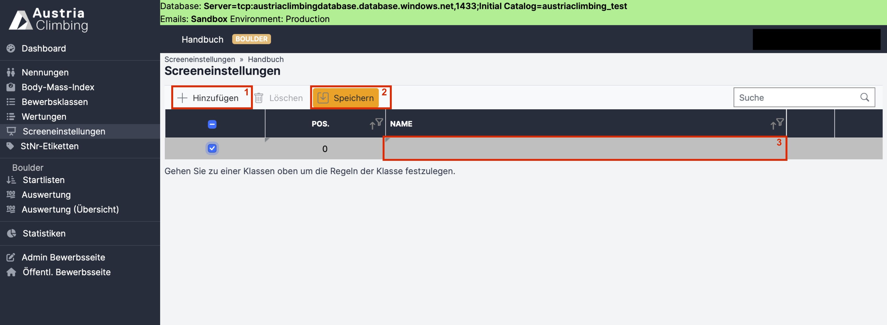
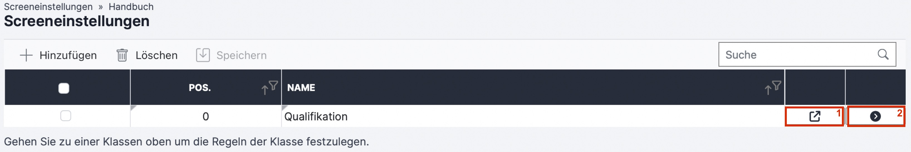
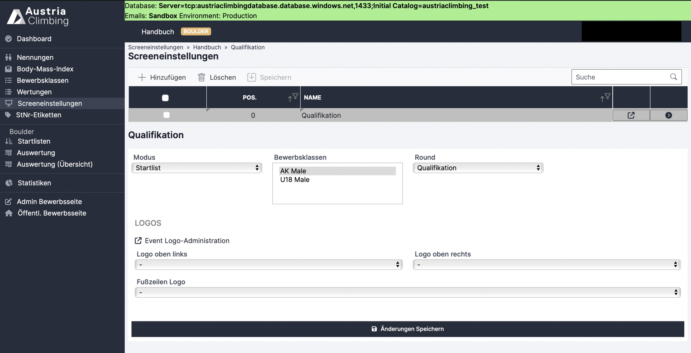

# Screeneinstellungen

In der Auswerteroberfläche im Register „Screeneinstellungen“ wird ein Link generiert über den eine Ergebnisdarstellung für z.B. Bildschirme vor Ort oder Livestreams abgerufen werden kann.

#### Neue Bildschirmanzeige erstellen

<figure><figcaption>
Neue Ergebnisdarstellung im Register "Screeneinstellungen"
</figcaption></figure>

* Mit Klick auf **„Hinzufügen“** (rotes Kästchen 1) erscheint eine neue, grau hinterlegte, Zeile
* In der Spalte **„Namen“** (rotes Kästchen 3) den entsprechenden Namen für die Bildschirmanzeige eingeben und auf **„Speichern“** (rotes Kästchen 2) klicken.&#x20;
* In der Spalte **„Pos“** kann die Position der jeweiligen Bildschirmanzeige geändert werden. Achtung: Durch Änderung der Position wird auch der Link der entsprechenden Ergebnisdarstellung verändert.

Nach dem Speichern erscheinen rechts zwei neue Buttons.

<figure><figcaption></figcaption></figure>

* Das Rechteck mit Pfeil (rotes Kästchen 1) öffnet direkt die Ergebnisanzeige in einem neuen Tab.&#x20;
  * Die Ergebnisanzeige kann im Weiteren auch direkt über den Link geöffnet werden (benötigt keine Anmeldung).&#x20;
  * Die Struktur des Links ist dabei immer die Gleiche.&#x20;
    * Beispiel: https://live.austriaclimbing.com/screen/2606/0\
      2606 entspricht der Bewerbs-ID und 0 der in der Tabelle definierten Position
* Der Pfeil nach rechts (rotes Kästchen 2) öffnet unter der Tabelle die Einstellungen für die jeweilige Bildschirmanzeige (siehe folgende Abbildung).

#### Einstellungsmöglichkeiten

<figure><figcaption>
Einstellungsmöglichkeiten der Bildschirmanzeige
</figcaption></figure>

* Im Dropdown-Menü **„Modus“** kann ausgewählt werden was dargestellt werden soll. Möglich ist:
  * Blank: schwarzer Bildschirm
  * Clock: aktuelle Uhrzeit
  * Startlist: Startliste
  * Resultlist: Ergebnisliste mit Darstellung aller Einzelwertungen (pro Boulder/Route) und Gesamtscore
  * Gesamtergebnis: Ergebnisliste mit Gesamtscore
* In der Tabelle **„Bewerbsklassen“** auswählen welche Bewerbsklassen in dem Link dargestellt werden sollen. Ausgewählte Bewerbsklassen werden, nach speichern, grau hinterlegt angezeigt (in der Abbildung ist „AK Männlich“ ausgewählt). Durch Markieren mehrerer Bewerbsklassen werden alle diese dargestellt.&#x20;
* Im Dropdown-Menü **„Round“** kann die zu darstellende Bewerbsrunde ausgewählt werden.
* **Logos** für rechts und links oben und in der Fußzeile können in den jeweiligen Dropdown-Menü ausgewählt werden. Individuelle Logos müssen vorher in der Adminoberfläche im Register „Logos“ hochgeladen werden, andernfalls ist je ein Logo bereits als Default im Dropdown-Menü, welches verwendet werden kann.
