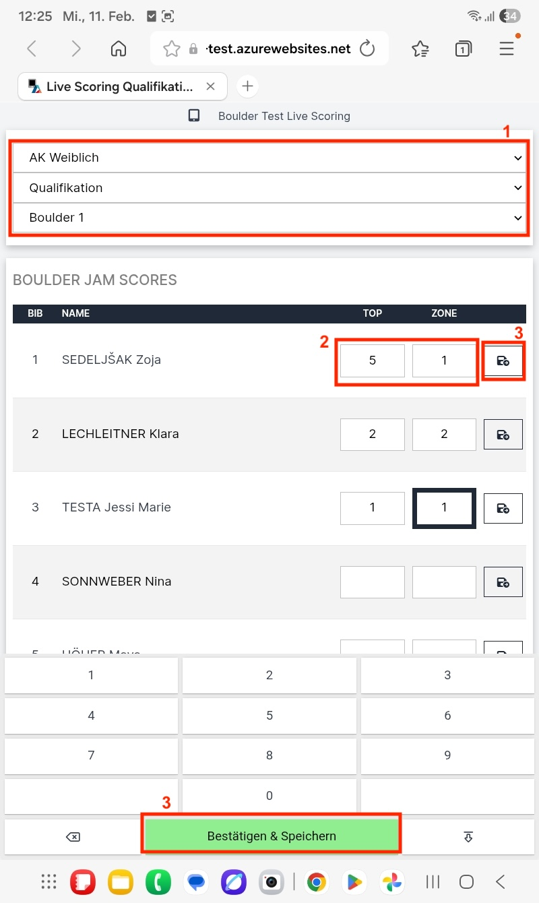

# Schiedsrichteroberfläche / Live Scoring (Boulder)

Die Ergebniseingabe für Schiedsrichter:innen kann über das Register „Auswertung“ in der Auswerteroberfläche geöffnet werden. Dazu das dunkelblaue Dropdown-Menü mit den drei Punkten anklicken und „Live Scoring“ auswählen. Der erscheinende QR-Code kann dann von anderen Endgeräten gescannt werden und öffnet so direkt die Schiedsrichteroberfläche, eine Anmeldung im System ist nicht nötig.

Alle Wertungen die vom Schiedsrichter über die LiveScoring Oberfläche eingetragen werden sind automatisch im LiveResults (online im Kalender bzw Screenanzeige) sichtbar. Im Backend/Auswertungsoberfläche muss man eventuell die Seite neu laden um die aktuellen Ergebnisse zu sehen.\
Wichtig: Im Format Boulderjam werden zwar Ergebnisse von den Geräten an das Auswertungs-Backend gesendet, aber keine Liveergebnisse online bzw am Screen angezeigt. Dies passiert automatisch wenn der richtige Durchführungsmodus (Jam) ausgewählt wurde.

### **Live Scoring Oberfläche Boulderjam:**

* im Modus "Jam" können die Judges im Live Scoring ausschließlich in Tabellenform eintragen.
* Schritt 1: Es muss oben die Runde, die Bewerbsklasse und der Boulder ausgewählt werden. (rotes Kästchen 1)
* Schritt 2: in der Tabelle scheinen alle Athlet:innen nach Startnummer gereiht auf. In der Tabelle können die Versuche für Top und Zone eingetragen werden (rotes Kästchen 2).
* Schritt 3: Speichern! Gespeichert werden kann mit dem "Disketten-Button" rechts in der Zeile. Oder bei der Eingabetastatur mit dem grünen Button "Bestätigen & Speichern". Im Idealfall wird nach jeder Eingabe, also nach jeder Athletin / jedem Athleten gespeichert. Es kann aber auch nach mehreren Eingaben gespeichert werden.

<figure><figcaption>
Live Scoring Oberfläche Boulderjam
</figcaption></figure>

Zur Info: Sollte das Top im selben Versuch wie die Zone erreicht werden, reicht die Eingabe des Tops und die Zone wird automatisch übernommen.

### **Live Scoring Oberfläche Weltcup-Modus & Wechselmodus:**

* Schritt 1: Der Boulder, die Runde und die Bewerbsklasse kann über die grauen Dropdown-Menüs geändert werden
* Schritt 2: Athlet:in in die Eingabemaske holen. Durch die folgenden Aktionen kann die Eingabeoberfläche der Athlet:innen geöffnet werden:
  * a) Mit Klick auf den großen gelben Button (rotes Kästchen 1) - automatisch nächste:r / erste:r Athlet:in
  * b) Über das Startnummernfeld (rotes Kästchen 2) durch eingabe der St.Nr und klick auf "Get"
  * c) Über den Pfeil rechts (rotes Kästchen 3) in der Tabelle

<figure><figcaption>
Live Scoring nach öffnen des QR-Codes
</figcaption></figure>

**Schritt 2: Bedienung der Eingabemaske:**

Ist die Eingabeoberfläche eines / einer Athleten:in ausgewählt verändert sich die Oberfläche zu folgender Ansicht:

<figure><figcaption></figcaption></figure>

* Klick auf **„Stage“** wenn der / die Athlet:in zum Boulder kommt und die Kletterzeit beginnt
* Mit dem **Plus und Minus** Button (rotes Kästchen 1) werden die Versuche gezählt, der aktuelle Versuch steht als Zahl zwischen den Buttons
* **Top und Zone** sind als ON/OFF Button dargestellt.
  * „OFF“ (rotes Kästchen 4) ist so lange eingestellt bis der / die Athlet:in eine Wertung (Zone oder Top) erzielt
  * “ON” (rotes Kästchen 3) wird geklickt, wenn der Athlet:in im aktuellen Versuch Zone/Top erreicht hat
  * Ist die Zone einmal erreicht und auf „ON“ gestellt bleibt es auch bei den weiteren Versuchen auf „ON“, auch wenn der / die Athlet:in die Zone nicht mehr erreicht hat (bitte nicht selbst auf „OFF“ stellen, wenn die Zone nicht noch einmal erreicht wird in den nächsten Versuchen)
* In der Mitte (rotes Kästchen 2) steht der **aktuelle Score**
* Die Wertungseingaben (Versuche, Zone, Top) werden **automatisch gespeichert** und sind direkt im Liveergebnis sichtbar
* Der / die aktuelle Athlet:in wird in der Tabelle grau hinterlegt angezeigt und der Livescore steht in den entsprechenden Zellen
* Klick auf **„Finish“** wenn der / die Athlet:in mit dem Boulder fertig ist. Das Ergebnis wird gesperrt und die Oberfläche ändert sich zu der folgenden Abbildung. Bei Boulderjam „Finish“ erst klicken wenn der / die Athlet:in nicht mehr zu dem Boulder kommen kann (Top geklettert, keine Versuche mehr bei limitierter Versuchszahl,…).

Nach Klick auf „Finish“ ist die Eingabeoberfläche des jeweiligen Athleten:in gesperrt, das wird mit einem grün hinterlegten Textfeld angezeigt.

<figure><figcaption></figcaption></figure>

* Mit Klick auf **„Trotzdem editieren“** öffnet sich die Eingabeoberfläche wieder mit den bereits eingegebenen Wertungen (es werden dabei KEINE Eingaben gelöscht)
* Mit Klick auf den **gelben Button** (rotes Kästchen 1) wird der / die nächste Athlet\*in geöffnet
* Bei Eingabe in der Tabelle wichtig: Sollte das Top im selben Versuch wie die Zone erreicht werden, reicht die Eingabe des Tops und die Zone wird automatisch übernommen (vor allem im Boulderjam sehr praktisch).

### Sperre der Live Scoring Oberfläche

Durch die Einstellung "Offizielles Ergebnis" bei einer Runde, wird die Judges Oberfläche automatisch deaktiviert. Falls die Judges sich noch in der Oberfläche aufhalten sollten oder der QR Code gescannet wird, erscheint folgende Information:

<figure><figcaption></figcaption></figure>
