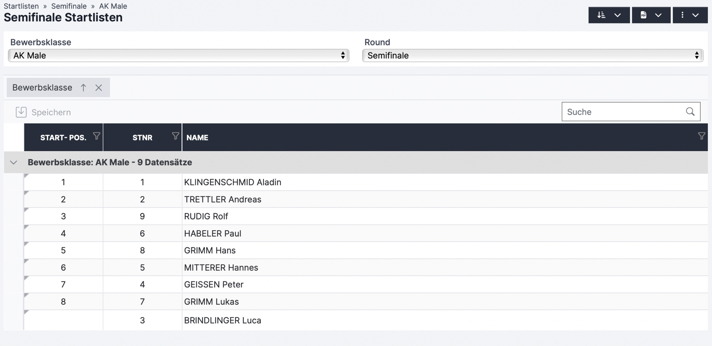

# Semifinale (Boulder)

Findet ein Semifinale statt, muss das im Register „Bewerbsklassen“ der Auswertungsoberfläche eingestellt werden. Die zusätzlichen zu treffenden Einstellungen (Quote, Modus, Anzahl Boulder,…) für diese Runde sind auf folgender Page erklärt:


[boulder.md](../vorbereitung-zur-bewerbsdurchfuhrung/bewerbsklassen-einstellungen/boulder.md)


#### Qualifikationsergebnis offiziell machen

* Nach Ende der Qualifikationsrunde und Kontrolle der Ergebnisse, **Status der entsprechenden Bewerbsklasse auf „Offizielles Ergebnis“** stellen. Dies kann in der Auswerteroberfläche im Register „Bewerbsklassen“ oder im Register „Auswertung“ gemacht werden.
* Sobald der Status einer Bewerbsklasse auf „Offizielles Ergebnis“ ist, können die Wertungen nicht mehr geändert werden (die Tabelle in den Auswertungsregistern sind grau hinterlegt für die jeweilige Bewerbsklasse). Um doch noch Änderungen vorzunehmen, muss der Status wieder geändert werden.

Im Rundenergebnis PDF sind die fürs Semifinale qualifizierten Athleten\*innen getrennt durch eine schwarze Linie von den nichtqualifizierten Athleten\*innen dargestellt.

#### Startlisten generieren

* Ähnlich wie Generierung der Qualifikationsstartlisten


[startliste.md](../vorbereitung-zur-bewerbsdurchfuhrung/startliste.md)


* Register „Startlisten“ der Auswertungsoberfläche

<figure><figcaption></figcaption></figure>

* Im Dropdown-Menü die Runde „Semifinale“ und die entsprechende Bewerbsklasse auswählen
* Startreihenfolge über den Button auslosen. Es gibt zwei Möglichkeiten:
  * Zufällig
  * Nach vorherigem Rundenergebnis: der am schlechtesten platzierte/r für das Semifinale qualifizierte/r Athlet\*in startet zuerst, der/die Bestplatzierte zum Schluss
* In der Tabelle werden alle registrierten Athlet\*innen angezeigt, aber nur fürs Semifinale qualifizierte Athlet\*innen haben eine Startposition
  * Siehe Abbildung: In diesem Beispiel sind neun Athleten in der Qualifikation gestartet und die besten Acht haben sich für das Semifinale qualifiziert)
* Startlisten, Schiedsrichterlisten, Laufzettel,… wie in der Page "Startliste" beschrieben öffnen

#### Sobald das Semifinale startet den Status der entsprechenden Bewerbsklasse auf „Läuft“ stellen

#### Ergebniseingabe über die Schiedsrichteroberfläche


[schiedsrichteroberflache-live-scoring-boulder.md](schiedsrichteroberflache-live-scoring-boulder.md)


#### Ergebniseingabe und -kontrolle in der Auswertungsoberfläche


[ergebniseingabe-register-auswertung-boulder.md](qualifikation-boulder/ergebniseingabe-register-auswertung-boulder.md)



[ergebniseingabe-register-auswertung-ubersicht-boulder.md](qualifikation-boulder/ergebniseingabe-register-auswertung-ubersicht-boulder.md)


#### Ergebnisanzeige für Bildschirm vor Ort oder Ähnliches in der Auswerteroberfläche im Register „Screeneinstellungen“ (OPTIONAL)


[screeneinstellungen.md](qualifikation-boulder/screeneinstellungen.md)


Nach Ende der Semifinalrunde und Kontrolle der Ergebnisse, **Status der entsprechenden Bewerbsklasse auf „Offizielles Ergebnis“** stellen.
