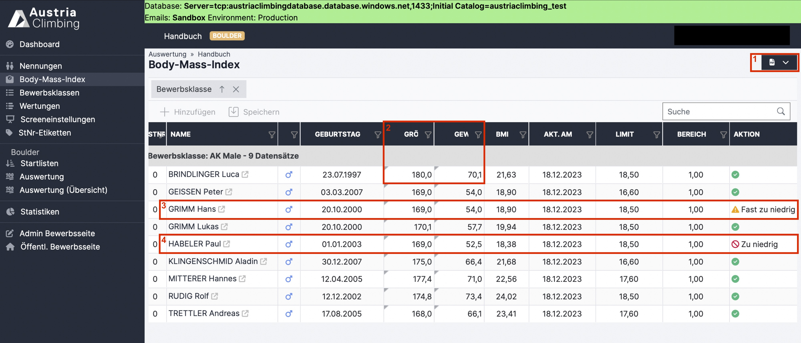

# Body-Mass-Index

Am Bewerbstag kann nach der Registrierung der Athlet\*innen eine BMI-Messung durchgeführt werden. Im Register „Body-Mass-Index“ in der Auswerteroberfläche können die Messwerte eingesehen und geändert werden.

&#x20;

<figure><figcaption>
BMI Einstellungen in der Auswerteroberfläche
</figcaption></figure>

* Im **PDF-Dropdown-Menü** (rotes Kästchen 1) kann, sowohl die Liste mit den BMI-Daten als auch die Liste ohne BMI-Daten heruntergeladen werden (zur händischen Eintragung durch den Jury Präsidenten bzw. KVÖ Judge)&#x20;
* In der Tabelle sind die registrierten Athleten\*innen aufgelistet
* Nur die Spalten **„Größe“ und „Gewicht“** (rotes Kästchen 2) sind veränderbare Zellen. Die Größe muss in Zentimeter und das Gewicht in Kilogramm eingetragen werden
* Mit Klick auf Speichern wird der BMI in der **„BMI“** Spalte automatisch berechnet
* Das BMI-Limit, in der Spalte **„Limit“**, ist im System nach KVÖ-Regelwerk fix festgelegt und hängt vom Geburtsjahr der Athlet\*innen ab
* Die Spalte **„Bereich“** gibt an, um welchen Wert der BMI über dem Limit liegen muss, um auch außerhalb des vom KVÖ festgelegten Beobachtungsrahmens zu liegen. Dies ist auch eine in der Datenbank fix hinterlegte Größe
* In der Spalte **„Aktion“** wird angegeben, ob der BMI des Athleten\*in passt (grüner Haken), im Beobachtungsrahmen liegt („Fast zu niedrig“ rotes Kästchen 3) oder unterhalb des Limits ist („Zu niedrig“ rotes Kästchen 4)

Bitte beachtet die Regelungen zur BMI-Messung in den Österr. Bestimmungen. Der / die Auswerter\*in hat die Daten lediglich nach der Messung in die Datenbank einzutragen. Weitere Aktionen, die auf Grund der Ergebnisse nötig sein könnten, obliegen ausschließlich der / dem Jury Präsident\*in. Die Daten sind vertraulich zu behandeln und die handgeschriebene Liste ist in weiterer Folge, bei nationalen Bewerben, nur dem KVÖ zu übergeben (Datenschutz-Koffer).
