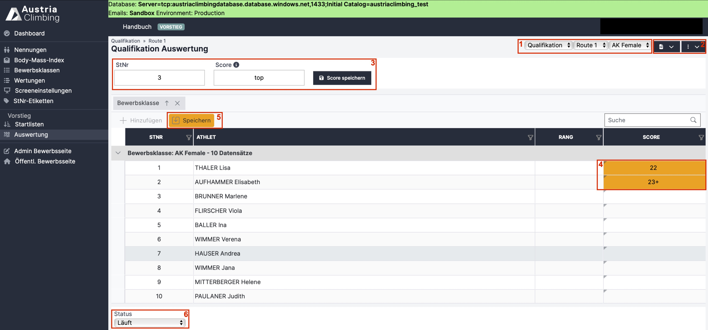

# Ergebniseingabe Register "Auswertung" (Lead)

Im Register „Auswertung“ der Auswerteroberfläche können die Ergebnisse eingetragen, kontrolliert und überarbeitet werden.&#x20;

<figure><figcaption>
Register "Auswertung" in der Lead Auswerteroberfläche
</figcaption></figure>

#### In den drei grau hinterlegten Dropdown-Menüs (rotes Kästchen 1) wird ausgewählt, was angezeigt und bearbeitet werden soll. Man wählt&#x20;

* Die entsprechende Runde (Qualifikation, Semifinale, Finale)
* Die Route&#x20;
* Die Bewerbsklasse. Es kann entweder eine einzelne Klasse oder „Alle“ ausgewählt werden. Bei „Alle“ werden alle Bewerbsklassen untereinander angezeigt.

#### Es gibt zwei Arten Ergebnisse einzugeben:

*   Über das Eingabefeld (rotes Kästchen 3)

    * Startnummer eingeben
    * Wertung als Zahl eingegeben
    * Eine Pluswertung wird mit dem Plus Symbol nach der Zahl eingeben – „23+“
    * Topwertung kann als „t“, „T“, „top“, „Top“, „TOP“ eingetragen werden
    * Klick auf „Score speichern“ um die Wertung in die Tabelle zu übernehmen

* In den entsprechenden Zellen der Tabelle (rotes Kästchen 4)
  * Die einzugebende Zahl entspricht dabei der Griffnummer laut Topo
  * Eine Pluswertung wird mit dem Plus Symbol nach der Zahl eingeben – „23+“
  * Topwertung kann als „t“, „T“, „top“, „Top“, „TOP“ eingetragen werden
  * Noch nicht gespeicherte Eingaben sind orange hinterlegt&#x20;
  * Klick auf „Speichern“ (rotes Kästchen 5) um diese Eingaben zu gespeichert, dieser Button blinkt orange so lange Tabelleneinträge noch nicht gespeichert sind

#### Im dunkelblauen Dropdown-Menü mit dem PDF-Symbol (rotes Kästchen 2) können folgende Ergebnislisten heruntergeladen werden:

*   Rundenergebnis PDF

    * Detailliertes Ergebnis der (im grauen Dropdown-Menü ausgewählten) Runde und Bewerbsklasse
    * Sind alle Bewerbsklassen ausgewählt, wird ein Dokument mit den Ergebnissen jeder Bewerbsklasse auf einer eigenen Seite erstellt&#x20;
    * Wertungen für jede Route sowie der Gesamtscore sind angegeben
    * Ist eine bereits im Register „Bewerbsklassen“ eine Quote für die nächste Runde (Semifinale oder Finale) eingetragen, so werden die für die nächste Runde qualifizierten Athlet\*innen mit einem schwarzen Strich von den nichtqualifizierten Athlet\*innen getrennt

*   Gesamtergebnis PDF

    * Gesamtergebnis der (im grauen Dropdown-Menü ausgewählten) Bewerbsklasse
    * Sind alle Bewerbsklassen ausgewählt, wird ein Dokument mit den Ergebnissen jeder Bewerbsklasse auf einer eigenen Seite erstellt
    * Es werden die Scores aller gekletterten Runden angegeben
    * Bei Status „Läuft“ oder „Inoffizielles Ergebnis“ der Bewerbsklasse (oder bei „Alle“ zumindest bei einer Bewerbsklasse), steht im Titel des Gesamtergebnis-PDFs „Inoffizielles Ergebnis“
    * Bei Status „Offizielles Ergebnis“ der Bewerbsklasse (oder bei „Alle“ bei allen Bewerbsklassen) ist der Titel im Dokument „Offizielles Ergebnis“

* Gesamtergebnis XLSX
  * Gesamtergebnis wie in Gesamtergebnis PDF beschrieben als XLSX-Datei. Achtung: 2 Tabellenblätter, Detailergebnisse sind auf Blatt 2

#### Im dunkelblauen Dropdown-Menü mit den drei senkrechten Punkten (rotes Kästchen 2) können folgende Aktionen ausgeführt werden:

* Ergebnisse simulieren
  * Simuliert zufällige Ergebnisse (für Testzwecke interessant)
* Ergebnisse löschen
  * Löscht alle Eintragungen/Ergebnis
  * Nach anklicken erscheint nochmal eine Warnung
  * Erst bei erneuter Bestätigung werden die Ergebnisse gelöscht
* Ergebnisse importieren
  * Ergebnisse vom alten KVÖ System importieren
* Aktualisieren
* Live Results senden
* Live Scoring
  * Öffnet den QR-Code und zeigt den Link für die Schiedsrichteroberfläche
  * QR-Code/Link ist automatisch auf die ausgewählte Runde, Boulder, Klasse eingestellt
  * Runde/Route/Klasse kann aber in der Schiedsrichteroberfläche noch geändert werden
  * Schiedsrichteroberfläche kann durch Scannen des QR-Codes oder Klick auf den Link geöffnet werden
