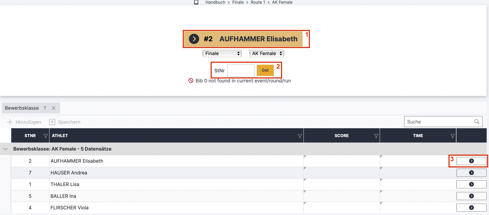
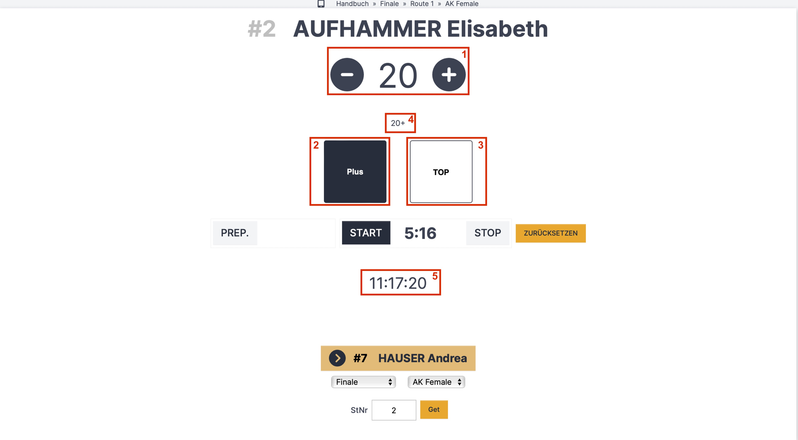
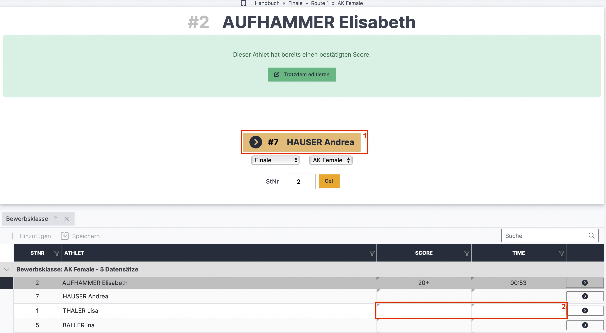

# Schiedsrichteroberfläche / Live Scoring (Lead)

Die Ergebniseingabe für Schiedsrichter kann über das Register „Auswertung“ in der Auswerteroberfläche geöffnet werden. Dazu das dunkelblaue Dropdown-Menü mit den drei Punkten anklicken und „Live Scoring“ auswählen. Der erscheinende QR-Code kann dann von anderen Endgeräten gescannt werden und öffnet so direkt die Schiedsrichteroberfläche, eine Anmeldung im System ist nicht nötig.

Alle Wertungen die vom Schiedsrichter über die LiveScoring Oberfläche eingetragen werden sind automatisch im LiveResults (online im Kalender bzw Screenanzeige) sichtbar. Im Backend/Auswertungsoberfläche muss man die Seite neu laden um die aktuellen Ergebnisse zu sehen.

Beim ersten Öffnen sieht die Oberfläche wie folgt aus:

**Startoberfläche Live Scoring Lead**

<figure><figcaption>
Lead Live Scoring nach öffnen des QR-Codes
</figcaption></figure>

* Schritt 1: Die Route, die Runde und die Bewerbsklasse kann über die grauen Dropdown-Menüs geändert werden
* Schritt 2: Durch die folgenden Aktionen kann die Eingabeoberfläche der Athlet:innen geöffnet werden:
  * a) Mit Klick auf den großen gelben Button (rotes Kästchen 1) - automatisch nächste:r / erste:r Athlet:in auf der entsprechenden Route
  * b) Über das Startnummernfeld (rotes Kästchen 2) durch eingabe der St.Nr und klick auf "Get"
  * c) Über den Pfeil rechts (rotes Kästchen 3) in der Tabelle

**Bedienung der Eingabemaske:**

<figure><figcaption>
Lead Live Scoring
</figcaption></figure>

* Mit Klick auf **„Prep“** wird die, im Register Bewerbsklassen eingestellte, Vorbereitungszeit heruntergezählt. Ist keine Vorbereitungszeit eingetragen ist dieser Button nicht nutzbar.
* Mit Klick auf **„Start“** wird die, im Register Bewerbsklassen eingestellte, Kletterzeit heruntergezählt. Ist keine Kletterzeit eingetragen ist dieser Button nicht nutzbar.
* Die aktuelle Uhrzeit ist unter den „Prep“, „Start“ und „Stop“ Buttons angegeben (rotes Kästchen 5)
* Mit dem **Plus und Minus Button** (rotes Kästchen 1) wird die Griffwertung gezählt
* **Plus und Top sind als ON/OFF Button** dargestellt.
  * „OFF“ (rotes Kästchen 3) ist so standardmäßig eingestellt
  * “ON” (rotes Kästchen 2) wird geklickt, wenn der / die Athlet:in bei dem Sturz die Pluswertung bekommt, oder die Route Top geklettert ist
* In der Mitte (rotes Kästchen 4) steht der **aktuelle Score**
* Die Wertungseingaben (aktueller Griffwert, Plus, Top) werden **automatisch gespeichert** und sind direkt im Liveergebnis sichtbar (somit sieht der Nutzer live, wo in der Route der Athlet sich gerade befindet, selbst wenn diese/r Athlet:in noch klettert)
* Aktuelle Athlet:innen werden in der Tabelle grau hinterlegt angezeigt und der Livescore steht in den entsprechenden Zellen
* Klick auf **„Stop“** um den Countdown der Kletterzeit zu stoppen.

Mit Klick auf den gelben Button (rotes Kästchen 1) wird der / die nächste Athlet:in der Startreihenfolge geöffnet und die Eingabeoberfläche des vorherigen Athlet:in gesperrt, das wird mit dem grün hinterlegten Textfeld angezeigt.

<figure><figcaption>
Lead Live Scoring nach Klick auf "Stop"
</figcaption></figure>

* Mit Klick auf **„Trotzdem editieren“** öffnet sich die Eingabeoberfläche wieder mit den bereits eingegebenen Wertungen (es werden dabei KEINE Eingaben gelöscht)

#### Zusätzliche Ergebniseingabe direkt über die Tabelle

* Nützlich vor allem in Qualifikationsrunden da das direkte Livescoring oft zu zeitaufwändig ist und in der Qualifikation meist nicht nötig ist
* In die entsprechende Zelle (rotes Kästchen 2) die Zahl des Versuchs, in dem die Wertung erreicht wurde, eintragen
* In der Tastatur die sich zur Wertungseingabe öffnet befindet sich ein grüner Button "Bestätigen". Diesen Klicken und somit den Score speichern
