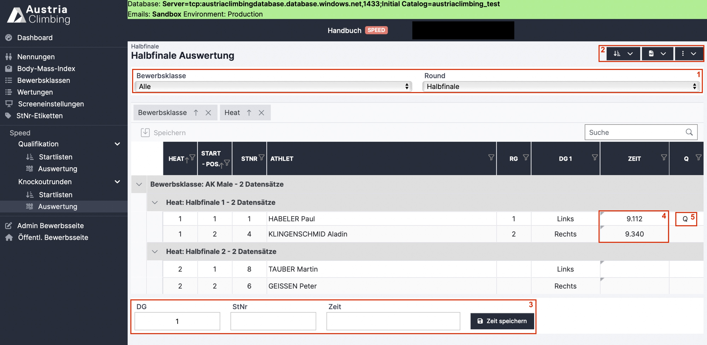

# Ergebniseingabe Knockoutrunden Register "Auswertung" (Speed)

Im Register „Auswertung“ unter der Überschrift „Knockoutrunden“ der Auswerteroberfläche können die Ergebnisse eingetragen, kontrolliert und überarbeitet werden.&#x20;

<figure><figcaption>
Auswertungsoberfläche Knockoutrunden Speed
</figcaption></figure>

#### In den zwei grau hinterlegten Dropdown-Menüs (rotes Kästchen 1) wird ausgewählt, was angezeigt und bearbeitet werden soll. Man wählt&#x20;

* Die Bewerbsklasse. Es kann entweder eine einzelne Klasse oder „Alle“ ausgewählt werden. Bei „Alle“ werden alle Bewerbsklassen untereinander angezeigt.
* Die Runde&#x20;

#### In der Tabelle werden die Athlet\*innen die gegeneinander in der Knockoutrunde antreten in dem entsprechenden „Heat“ dargestellt und sortiert

* In der Spalte „DG1“ wird angegeben auf welcher Linie (Links oder Rechts) der jeweilige Athlet\*in des Heats startet
* In der Spalte „Q“ steht ein „Q“ bei dem für die nächste Runde qualifizierten Athleten\*in (rotes Kästchen 5)

#### Es gibt zwei Arten Ergebnisse einzugeben:

* Über das Eingabefeld (rotes Kästchen 3)
  * Ergebniseingabe für den im Dropdown ausgewählten Durchgang
  * Startnummer eingeben
  * Zeit in Sekunden eingegeben („6.1“ sowie „6,1“ ist erlaubt)
  * Ein Fehlstart kann als „FS“, „fs“, „Fehlstart“ eingetragen werden
  * Ein Sturz kann als „Sturz“, „sturz“, „Fall“, „fall“ eingetragen werden
  * Klick auf „Zeit speichern“ um die Wertung in die Tabelle zu übernehmen
*   In den entsprechenden Zellen der Tabelle (rotes Kästchen 4)

    * Die einzugebende Zahl entspricht dabei der Kletterzeit in Sekunden („6.1“ sowie „6,1“ ist erlaubt)
    * Ein Fehlstart kann als „FS“, „fs“, „Fehlstart“ eingetragen werden
    * Ein Sturz kann als „Sturz“, „sturz“, „Fall“, „fall“ eingetragen werden
    * Noch nicht gespeicherte Eingaben sind orange hinterlegt
    * Klick auf „Speichern“ um diese Eingaben zu gespeichert, dieser Button blinkt orange so lange Tabelleneinträge noch nicht gespeichert sind

#### Im dunkelblauen Dropdown-Menü mit den drei Linien und dem Pfeil nach unten (rotes Kästchen 2) kann direkt die Startreihenfolge der, im Dropdownmenü ausgewählten, Runde verlost werden

* Es kann nur „nach vorherigem Rundenergebnis“ ausgewählt werden
* Dadurch ist es möglich Startlisten der Knockoutrunden zu erstellen, ohne auf das Register „Startnummern“ gehen zu müssen
* Für schnell aufeinanderfolgende Knockoutrunden sehr praktisch&#x20;

#### Im dunkelblauen Dropdown-Menü mit dem PDF-Symbol (rotes Kästchen 2) können folgende Ergebnislisten heruntergeladen werden:

*   Rundenergebnisliste

    * Ergebnis der im grauen Dropdown-Menü ausgewählten Bewerbsklasse und Runde
    * Sind alle Bewerbsklassen ausgewählt, wird ein Dokument mit den Ergebnissen jeder Bewerbsklasse auf einer eigenen Seite erstellt&#x20;
    * Der / die für die nächste Runde qualifizierte Athlet\*in ist mit einem „Q“ markiert

*   Raster

    * Alle Knockoutrunden als Raster dargestellt
    * Bereits gekletterte Runden beinhalten das Ergebnis
    * Für noch nicht gekletterte Runden wird entweder die Startreihenfolge dargestellt, oder ist diese noch nicht bekannt ist das Raster leer

*   Gesamtergebnis PDF

    * Gesamtergebnis der im grauen Dropdown-Menü ausgewählten Bewerbsklasse
    * Sind alle Bewerbsklassen ausgewählt, wird ein Dokument mit den Ergebnissen jeder Bewerbsklasse auf einer eigenen Seite erstellt
    * Es werden die Zeiten aller gekletterten Runden angegeben
    * Bei Status „Läuft“ oder „Inoffizielles Ergebnis“ der Bewerbsklasse (oder bei „Alle“ zumindest bei einer Bewerbsklasse), steht im Titel des Gesamtergebnis-PDFs „Inoffizielles Ergebnis“
    * Bei Status „Offizielles Ergebnis“ der Bewerbsklasse (oder bei „Alle“ bei allen Bewerbsklassen) ist der Titel im Dokument „Offizielles Ergebnis“

* Gesamtergebnis XLSX
  * Gesamtergebnis wie in Gesamtergebnis PDF beschrieben als XLSX-Datei. Achtung: 2 Tabellenblätter, Detailergebnisse sind auf Blatt 2

#### Im dunkelblauen Dropdown-Menü mit den drei senkrechten Punkten (rotes Kästchen 2) können folgende Aktionen ausgeführt werden:

* Ergebnisse simulieren
  * Simuliert zufällige Ergebnisse (für Testzwecke interessant)
* Ergebnisse löschen
  * Löscht alle Eintragungen/Ergebnis
  * Nach anklicken erscheint nochmal eine Warnung
  * Erst bei erneuter Bestätigung werden die Ergebnisse gelöscht
* Ergebnisse importieren
  * Ergebnisse vom alten KVÖ System importieren
* Aktualisieren
* Live Results senden
