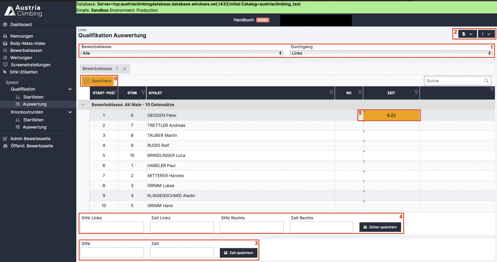

# Ergebniseingabe Qualifikation Register "Auswertung" (Speed)

Im Register „Auswertung“ unter der Überschrift „Qualifikation“ der Auswerteroberfläche können die Ergebnisse eingetragen, kontrolliert und überarbeitet werden.&#x20;

<figure><figcaption>
Auswertungsoberfläche Qualifikation Speed
</figcaption></figure>

&#x20;

#### In den zwei grau hinterlegten Dropdown-Menüs (rotes Kästchen 1) wird ausgewählt, was angezeigt und bearbeitet werden soll. Man wählt&#x20;

* Die Bewerbsklasse. Es kann entweder eine einzelne Klasse oder „Alle“ ausgewählt werden. Bei „Alle“ werden alle Bewerbsklassen untereinander angezeigt.
* Den Durchgang&#x20;

#### Es gibt drei Arten Ergebnisse einzugeben:

*   Über das „kleine“ Eingabefeld (rotes Kästchen 3)

    * Ergebniseingabe für den im Dropdown ausgewählten Durchgang
    * Startnummer eingeben
    * Zeit in Sekunden eingegeben („6.1“ sowie „6,1“ ist erlaubt)
    * Ein Fehlstart kann als „FS“, „fs“, „Fehlstart“ eingetragen werden
    * Ein Sturz kann als „Sturz“, „sturz“, „Fall“, „fall“ eingetragen werden
    * Klick auf „Zeit speichern“ um die Wertung in die Tabelle zu übernehmen

*   Über das „große" Eingabefeld (rotes Kästchen 4)

    * Ergebniseingabe für Links und Rechts gleichzeitig
    * Startnummer Athlet\*in des Durchgangs „Links“ eingeben
    * Entsprechende Zeit in Sekunden des Durchgangs „Links“ eingeben
    * Startnummer Athlet\*in des Durchgangs „Rechts“ eingeben
    * Entsprechende Zeit in Sekundendes Durchgangs „Rechts“ eingeben
    * Ein Fehlstart kann als „FS“, „fs“, „Fehlstart“ eingetragen werden
    * Ein Sturz kann als „Sturz“, „sturz“, „Fall“, „fall“ eingetragen werden
    * Klick auf „Zeiten speichern“ um die Wertung in die Tabelle zu übernehmen

* In den entsprechenden Zellen der Tabelle (rotes Kästchen 5)
  * Die einzugebende Zahl entspricht dabei der Kletterzeit in Sekunde („6.1“ sowie „6,1“ ist erlaubt)
  * Ein Fehlstart kann als „FS“, „fs“, „Fehlstart“ eingetragen werden
  * Ein Sturz kann als „Sturz“, „sturz“, „Fall“, „fall“ eingetragen werden
  * Noch nicht gespeicherte Eingaben sind orange hinterlegt
  * Klick auf „Speichern“ (rotes Kästchen 6) um diese Eingaben zu gespeichert, dieser Button blinkt orange so lange Tabelleneinträge noch nicht gespeichert sind

#### Im dunkelblauen Dropdown-Menü mit dem PDF-Symbol (rotes Kästchen 2) können folgende Ergebnislisten heruntergeladen werden:

*   Qualifikationsergebnisliste

    * Qualifikationsergebnis der im grauen Dropdown-Menü ausgewählten Bewerbsklasse
    * Sind alle Bewerbsklassen ausgewählt, wird ein Dokument mit den Ergebnissen jeder Bewerbsklasse auf einer eigenen Seite erstellt&#x20;
    * Zeiten für jeden Durchgang sowie der Gesamtscore sind angegeben
    * Ist eine bereits im Register „Bewerbsklassen“ eine Quote für die nächste Runde eingetragen, so werden die für die nächste Runde qualifizierten Athlet\*innen mit einem schwarzen Strich von den nichtqualifizierten Athlet\*innen getrennt

*   Gesamtergebnis PDF

    * Gesamtergebnis der im grauen Dropdown-Menü ausgewählten Bewerbsklasse
    * Sind alle Bewerbsklassen ausgewählt, wird ein Dokument mit den Ergebnissen jeder Bewerbsklasse auf einer eigenen Seite erstellt
    * Es werden die Scores aller gekletterten Runden angegeben
    * Bei Status „Läuft“ oder „Inoffizielles Ergebnis“ der Bewerbsklasse (oder bei „Alle“ zumindest bei einer Bewerbsklasse), steht im Titel des Gesamtergebnis-PDFs „Inoffizielles Ergebnis“
    * Bei Status „Offizielles Ergebnis“ der Bewerbsklasse (oder bei „Alle“ bei allen Bewerbsklassen) ist der Titel im Dokument „Offizielles Ergebnis“

* Gesamtergebnis XLSX
  * Gesamtergebnis wie in Gesamtergebnis PDF beschrieben als XLSX-Datei. Achtung: 2 Tabellenblätter, Detailergebnisse sind auf Blatt 2

#### Im dunkelblauen Dropdown-Menü mit den drei senkrechten Punkten (rotes Kästchen 2) können folgende Aktionen ausgeführt werden:

* Ergebnisse simulieren
  * Simuliert zufällige Ergebnisse (für Testzwecke interessant)
* Ergebnisse löschen
  * Löscht alle Eintragungen/Ergebnis
  * Nach anklicken erscheint nochmal eine Warnung
  * Erst bei erneuter Bestätigung werden die Ergebnisse gelöscht
* Ergebnisse importieren
  * Ergebnisse vom alten KVÖ System importieren
* Aktualisieren
* Live Results senden
