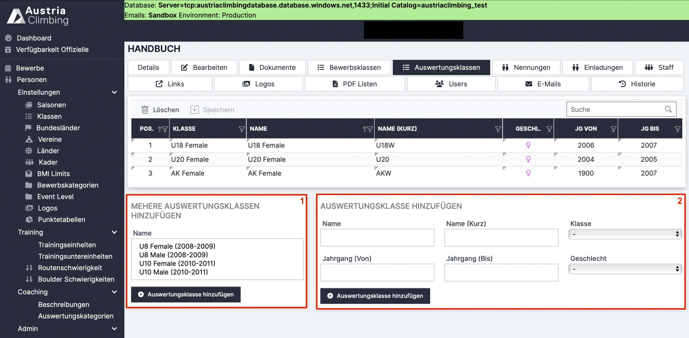

# Auswertungsklassen (Adminoberfläche)

Auswertungsklassen sind die Klassen in denen die Athlet\*innen, zusätzlich zu den Bewerbsklassen, gewertet werden können. Dies wird zum Beispiel genutzt, wenn der Wettkampf nur in der Allgemeinen Klasse ausgetragen wird, man jedoch auch die Nachwuchswertungen für U18 und U20 bestimmen möchte.&#x20;

Im Register „Auswertungsklassen“ können diese Auswertungsklassen hinzugefügt werden, sie sind aber nicht Pflicht. Wird sowieso nur in den Bewerbsklassen ausgewertet müssen nicht zusätzlich die gleichen Klassen als Auswertungsklassen angelegt werden.

<figure><figcaption>
Adminoberfläche Register „Auswertungsklassen“
</figcaption></figure>

* Im Fenster **„Mehrere Auswertungsklassen hinzufügen“** (rotes Kästchen 1) kann man vordefinierte Auswertungsklassen zum Bewerb hinzufügen. Dazu die entsprechende/n Auswertungsklasse/n auswählen und auf den Button „Auswertungsklasse hinzufügen“ klicken. Alle „klassischen“ Altersklassen sowie die Paraclimbingklassen sind, inclusive der richtigen Jahrgänge, vordefiniert.
* Im Fenster **„Auswertungsklasse hinzufügen“** (rotes Kästchen 2) können neue Auswertungsklassen hinzugefügt werden. Dazu den Namen und die Jahrgangsbegrenzung eintragen und auf „Auswertungsklasse hinzufügen“ klicken. Die Felder „Klasse“, „Geschlecht“ und „Maximale Anzahl Teilnehmer“ sind optionale Eingabemöglichkeiten.
* Um eine bereits hinzugefügte Auswertungsklasse zu löschen die entsprechende Auswertugsklasse in der Tabelle auswählen und auf den Button „Löschen“ klicken.
* &#x20;Alle Tabelleneinträge der bereits hinzugefügten Bewerbsklassen können mit Doppelklick in die entsprechende Zelle noch geändert werden.&#x20;
