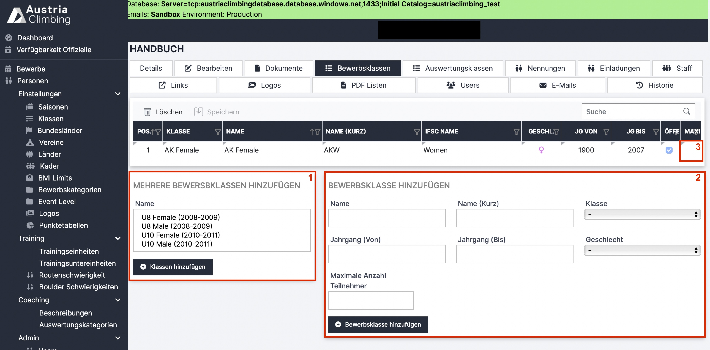

# Bewerbsklassen (Adminoberfläche)

Bewerbsklassen sind die Klassen, in denen der Wettkampf durchgeführt wird. Die Athlet\*innen können sich nur für diese Klassen zum Bewerb anmelden. Im Register „Bewerbsklassen“ werden die beim Wettkampf stattfindenden Bewerbsklassen hinzugefügt.

<figure><figcaption>
Adminoberfläche Register „Bewerbsklassen“
</figcaption></figure>

* Im Fenster **„Mehrere Bewerbsklassen hinzufügen“** (rotes Kästchen 1) kann man vordefinierte Bewerbsklassen zum Bewerb hinzufügen. Dazu die entsprechende/n Bewerbsklasse/n auswählen und auf den Button „Klassen hinzufügen“ klicken. Alle „klassischen“ Altersklassen sowie die Paraclimbingklassen sind, inclusive der richtigen Jahrgänge, vordefiniert.
* Im Fenster **„Bewerbsklasse hinzufügen“** (rotes Kästchen 2) können neue Bewerbsklassen hinzugefügt werden. Dazu den Namen und die Jahrgangsbegrenzung eintragen und auf „Bewerbsklasse hinzufügen“ klicken. Die Felder „Klasse“, „Geschlecht“ und „Maximale Anzahl Teilnehmer“ sind optionale Eingabemöglichkeiten.
* Um eine bereits hinzugefügte Bewerbsklasse zu löschen die entsprechende Bewerbsklasse in der Tabelle auswählen und auf den Button „Löschen“ klicken.
* Alle Tabelleneinträge der bereits hinzugefügten Bewerbsklassen können noch geändert werden. Um zum Beispiel eine maximale Teilnehmerzahl für die Bewerbsklasse AK Female hinzuzufügen, Doppelklick in die Zelle (rotes Kästchen 3), maximale Teilnehmeranzahl eintippen und auf „Speichern“ klicken.
