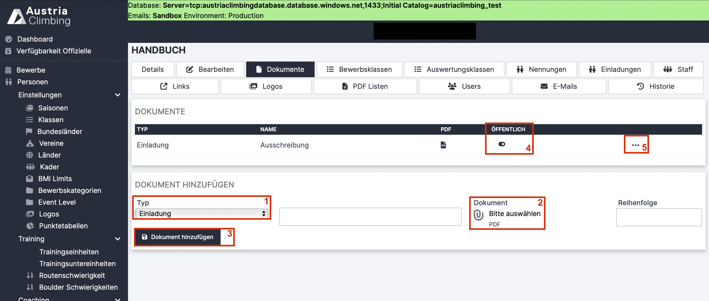

# Dokumente (Adminoberfläche)

Dokumente, die auf der öffentliche Bewerbsseite hochgeladen werden sollen, können im Register „Dokumente“ in den Bewerb importiert werden.

<figure><figcaption>
Adminoberfläche Register "Dokumente"
</figcaption></figure>

*   Im Dropdown-Menü „Typ“ (rotes Kästchen 1) wählt man Dokumententyp aus. Alle Dokumente müssen als PDF hochgeladen werden. Möglich ist (Stand 02/2024):

    * Einladung (aka Ausschreibung)
    * &#x20;Startliste
    * &#x20;Ergebnisliste
    * Anmeldevereinbarung
    * Andere

* Gewünschten Namen eingeben
* &#x20;Auf das Symbol unter „Dokument“ (rotes Kästchen 2) klicken, gewünschte Datei auswählen und auf „Hochladen“ drücken. Nicht wundern, im Anzeigefenster ändert sich noch nichts.
* Auf „Dokument hinzufügen“ (rotes Kästchen 3) klicken
* Nun erscheint in der Tabelle das hinzugefügte Dokument
* Mit dem „Öffentlich ON/OFF-Button“ (rotes Kästchen 4) kann ausgewählt werden, ob das Dokument in der öffentlichen Bewerbsseite (im Kalender) sichtbar sein soll.
* Um ein Dokument zu löschen auf die drei Punkte in der Zeile des Dokuments (rotes Kästchen 5) klicke und „Löschen“ auswählen.
