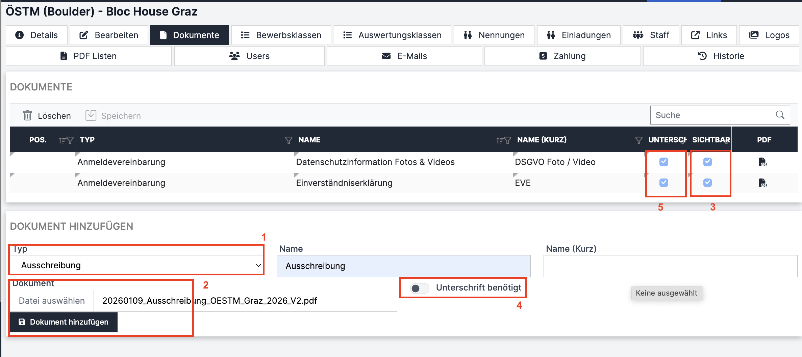
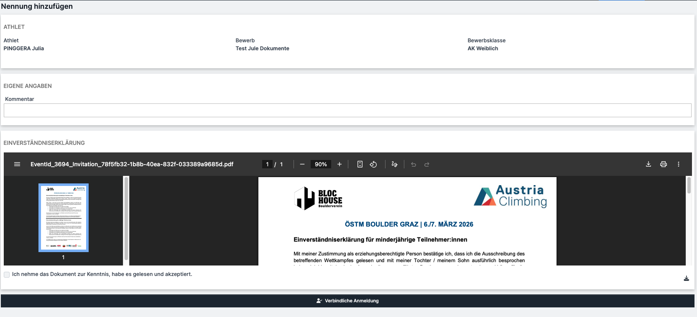

# Dokumente (Adminoberfläche)

Dokumente, die auf der öffentliche Bewerbsseite hochgeladen werden sollen, können im Register „Dokumente“ in den Bewerb importiert werden. Diese Dokumente werden zur Information der Athlet:innen (z.B. Ausschreibung) oder auch zur Unterzeichnung durch die Athlet:innen (z.B. Einverständniserklärung) hochgeladen.

<figure><figcaption>
Adminoberfläche Register "Dokumente"
</figcaption></figure>

* Im Dropdown-Menü „Typ“ (rotes Kästchen 1) wählt man den Dokumententyp aus. Möglich sind:
  * Ausschreibung
  * Startliste
  * Ergebnisliste
  * Anmeldevereinbarung (z.B. Einverständniserklärung / Datenschutzhinweise -> gesonderter Absatz unten)
  * Andere
* Gewünschten Namen des Dokuments eingeben
* Auf die leere Zelle bei "Dokument" (rotes Kästchen 2) klicken, gewünschte Datei auswählen (muss ein PDF sein) und "hochladen". Dann "Dokument hinzufügen" klicken. Das Dokument erscheint jetzt oben in der Tabelle.
* Mit dem „Sichtbar ON/OFF-Button“ (rotes Kästchen 3) kann ausgewählt werden, ob das Dokument in der öffentlichen Bewerbsseite (im Kalender) sichtbar sein soll.
* Um ein Dokument zu löschen, die gewünschte Zeile in der Tabelle markieren (anklicken) und oberhalb der Tabelle auf "Löschen" und dann auf "Speichern" klicken.

**Dokumente zur Unterzeichnung: "Anmeldevereinbarungen"**

* Unter dem Typ "Anmeldevereinbarung" können z.B. **Einverständniserklärungen oder Datenschutzhinweise** hochgeladen werden, die der Veranstalter mit den Athlet:innen teilen möchte.
* Wenn diese Dokumente von den Teilnehmer:innen gelesen und akzeptiert werden sollen, um die Anmeldung durchzuführen, dann bitte "Unterschrift benötigt" auswählen (rotes Kästchen 4).
* Diese Dokumente werden in der Tabelle mit einem Haken bei "Unterschrift" angezeigt (rotes Kästchen 5). Der Haken könnte auch nach dem Hinzufügen in der Tabelle noch entfernt werden, falls ein Fehler unterlaufen ist.

Dokumente, die gelesen und akzeptiert werden müssen, werden den Athlet:innen wie folgt im Rahmen der Anmeldung angezeigt. Ohne den Haken (gelesen & akzeptiert) zu setzen kann man die Anmeldung nicht abschließen.\
Eine tatsächliche physische Unterschrift kann nicht eingefordert werden, sondern lediglich die zur Kenntnisnahme durch Abhaken.

<figure><figcaption></figcaption></figure>
