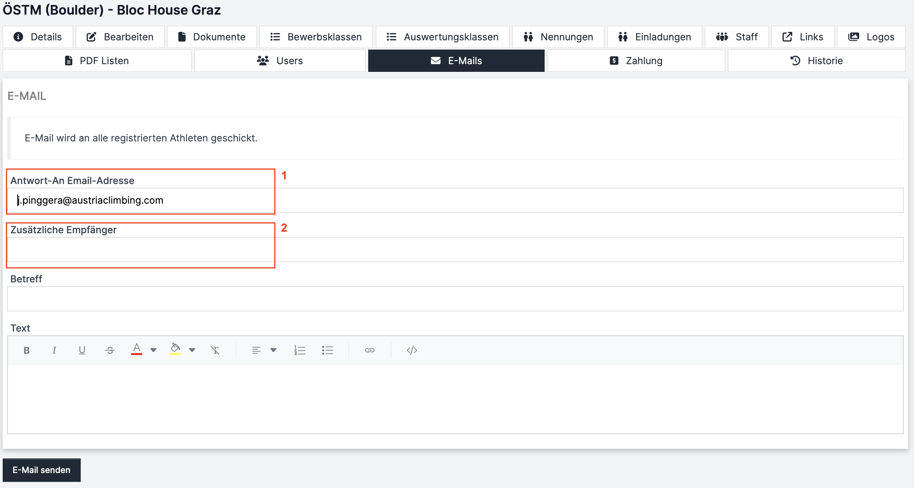

# E-Mails (Adminoberfläche)

Im Register „E-Mails“ kann ein E-Mail an alle registrierten Athlet:innen geschickt werden.

Zum Beispiel im Falle von Zeitplanänderungen, ist dies die schnellste Möglichkeit, mit den Teilnehmer:innen zu kommunizieren.

<figure><figcaption></figcaption></figure>

* Die E-Mail wird automatisch an alle genannten Athlet:innen und die damit verknüpften User geschickt. Es ist grundsätzlich keine Eingabe von Mailadressen nötig.
* Die Mails werden vom Mail Account der Datenbank geschickt (data@austriaclimbin.com). Allerdings ist es möglich eine Antwort-An Mail Adresse einzustellen, damit die Athlet:innen sich im Falle von Fragen direkt an den Veranstalter werden können (rotes Kästchen 1). Hier ist standardmäßig der Mail-Kontakt aus den Bewerbsdetails eingetragen.
* Es können zusätzliche Empfänger:innen Mail-Adressen eingegeben werden (rotes Kästchen 2). Hier könnte man z.B. die Bewerbsoffiziellen in den Verteiler aufnehmen.
* Betreff & Text sind nun auszufüllen. Es können keine Anhänge mitgeschickt werden. Allerdings ist es möglich im Mailtext zu verlinken. Wichtige Dokumente könnte man also unter "Dokumente" hochladen und den Link zur Detailseite des Wettkampfes in der Mail verlinken.
* Alternativ zur automatischen Aussendung der Mails an alle kann man die Mail Adressen der Teilnehmer:innen auch der internen Nennliste (siehe 3.5.) entnehmen und diese anschreiben. Das macht z.B. Sinn, wenn nur gewisse Athlet:innen von einer Information betroffen sind.
