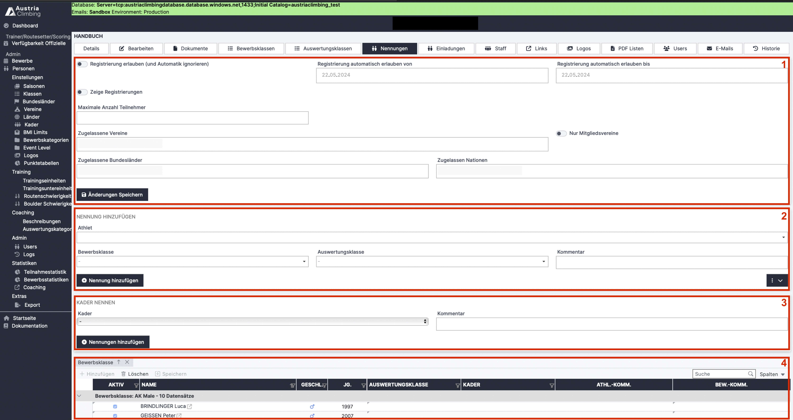

# Nennungen (Adminoberfläche)

Im Register „Nennungen“ kann die automatische Registrierung aktiviert werden. Außerdem ist es möglich Athlet\*innen für den Bewerb direkt zu nennen.

<figure><figcaption>
Adminoberfläche Register "Nennungen"
</figcaption></figure>

*   Im ersten Bereich (rotes Kästchen 1) kann die automatische Registrierung eingestellt werden.

    * Mit dem ON/OFF-Button **„Registrierung erlauben“** kann die Registrierung aktiviert werden
    * In den **Datumsfeldern** wird der Zeitraum eingegeben in dem Athlet\*innen sich registrieren können
    * Der ON/OFF-Button **„Zeige Registrierung“** gibt an, ob alle bereits registrierte Athlet\*innen in der öffentlichen Bewerbsseite aufgelistet sind (Nennungen)
    * **„Maximale Anzahl Teilnehmer“** gibt an ab wie vielen Teilnehmer\*innen für den gesamten Bewerb eine Registrierung nichtmehr möglich ist
    * Mit dem ON/OFF-Button **"Medizinische Zertifikate"** wird eingestellt ob beim Anmeldungsmail an die Athelt\*innen an das medizinische Zertifikat erinnert werden sollen
    * Die restlichen Felder sind Filter welche Athlet\*innen sich für diesen Bewerb registrieren können

* Im zweiten Bereich (rotes Kästchen 2) können Athlet\*innen direkt für den Bewerb genannt werden
* Im dritten Bereich (rotes Kästchen 3) können alle Athlet\*innen eines Kaders (auszuwählen im DropDown-Menü) direkt für den Bewerb genannt werden.&#x20;
* Im letzten Bereich (rotes Kästchen 4) ist die Tabelle mit allen bereits genannten Athlet\*innen. In dieser können Athlet\*innen auch, durch Auswahl der Athlet\*in und Klick auf „Löschen“, wieder aus dem Bewerb entfernt werden.
