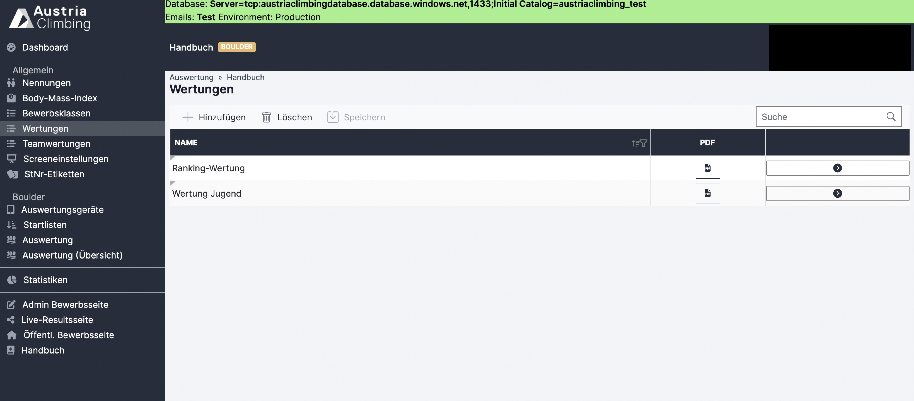

# Bewerbe

Im Register „Bewerbe“ werden die fürs Ranking in Betracht gezogene Bewerbe ausgewählt und die Daten importiert.

<figure><figcaption>
Register "Bewerbe" in der Auswerteroberfläche eines Ranking Bewerbs
</figcaption></figure>

* Mit Klick auf „Hinzufügen“ erscheint eine neue Zeile in der Tabelle
* In der Spalte „Bewerb“ den entsprechenden Wettkampf auswählen
* In der Spalte „Punktetabelle“ auswählen welche Tabelle zur Bestimmung der Punkte per Rang verwendet werden soll
* In der Spalte "Berechnung Bewerbspunkte" auswählen ob die Punkte nach Bewerbsrang oder nach Wertungsrang  vergeben werden sollen (genauer erklärt in "Einstellungen").
* Mit Klick auf „Speichern“ wird der ausgewählte Bewerb dem Ranking hinzugefügt
* Nun erscheint ein Pfeil-Button rechts (rotes Kästchen 1).
* Mit Klick auf den Pfeil öffnet sich folgende Seite, in der die Ergebnisse des ausgewählten Bewerbs importiert werden können.

<figure><figcaption>
Register "Bewerbe" nach Klick auf den Pfeil eines Bewerbs
</figcaption></figure>

* Im oberen Feld können noch einige Einstellungen gemacht werden. Die Felder "Gruppe", "Punktetabelle" und "Berechnung Bewerbspunkte" werden dabei aus der Tabellenzeile der vorherigen Seite übernommen, können aber geändert werden.
* Das Feld Wertungen (rotes Kästchen 1) entscheidet welche Wertung/Ergebnis von dem ausgewählten Bewerb in den Rankingbewerb importiert wird. Dazu muss in dem Bewerb (hier der Handbuch Boulder) eine Wertung erstellt werden die die Daten filtert die für das Ranking relevant sind.  Mit dem kleine Button direkt neben "Wertung" gelangt man direkt zum Register "Wertungen" des jeweiligen Bewerbs und kann dort alles nachvollziehen / bearbeiten (sofern Zugriff besteht).\
  Im folgenden Bild sieht man, dass in einem Boulderbewerb eine Wertung mit dem Namen "Ranking-Wertung" erstellt wurde. Auch die zweite Wertung wäre im Rankingbewerb im Dropdown zur Auswahl, enthält jedoch dann nur die Nachwuchsathlet:innen.

<figure><figcaption>
Wertungen im Boulderbewerb
</figcaption></figure>

* Mit Klick auf „Ergebnisse importieren und Punkte zuweisen“ (rotes Kästchen 2) werden die Athlet:innen und deren Ergebnisse der ausgewählten Wertung des Bewerbs importiert, in der unteren Tabelle (rotes Kästchen 3) angezeigt und die Punkte den jeweiligen Rängen zugewiesen.&#x20;
