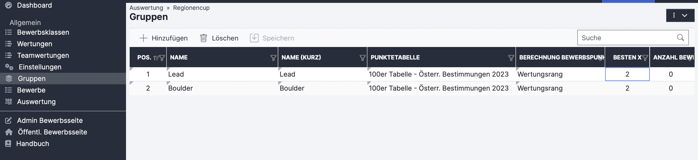

# Gruppen

Werden nur dann benötigt, wenn a) den zählenden Bewerben unterschiedliche Punktetabellen zu Grunde liegen sollen (wird de facto nur bei KVÖ internen Rankings verwendet) oder b) wenn mehrere Bewerbe zu Bewerbsblöcken/Gruppen zusammengefasst werden (z.B. Disziplinen) und in den jeweiligen Bewerbsblöcken/Gruppen unterschiedliche Streichresultate/Mindestanzahl an Bewerben gelten.&#x20;

\
Beispiel: Gesamtwertung ÖM Boulder\&Lead. Dazu werden die besten 2 Boulderergebnisse und die besten 2 Leadergebnisse gezählt. Es gab jedoch 4 Boulderbewerbe und 2 Leadbewerbe. Würde man nun nur in Einstellungen "Anzahl bester Bewerbsergebnisse" 4 auswählen könnte das auch dazu führen dass die vier Boulderbewerbe zählen. In diesem Fall macht man eine Gruppe "Lead" und eine Gruppe "Boulder" und trägt in der Tabelle die entsprechenden Werte ein. Zusätzlich muss dann unter "Bewerbe" bei den jeweiligen Bewerben die entsprechende Gruppe ausgewählt werden.

<figure><figcaption></figcaption></figure>

Für normale Gesamtwertungen / Cup-Wertungen muss bei Gruppen nichts eingetragen werden.
