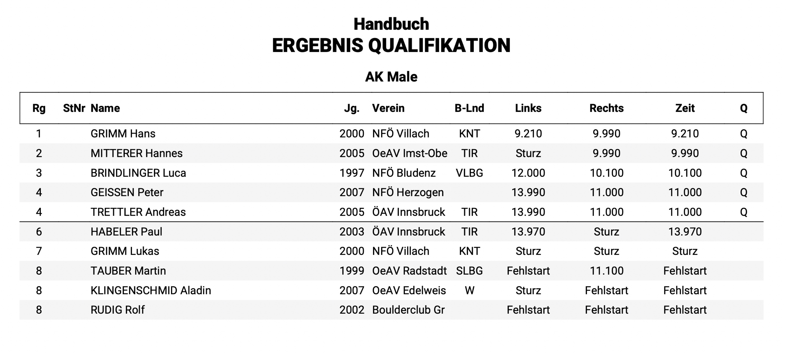
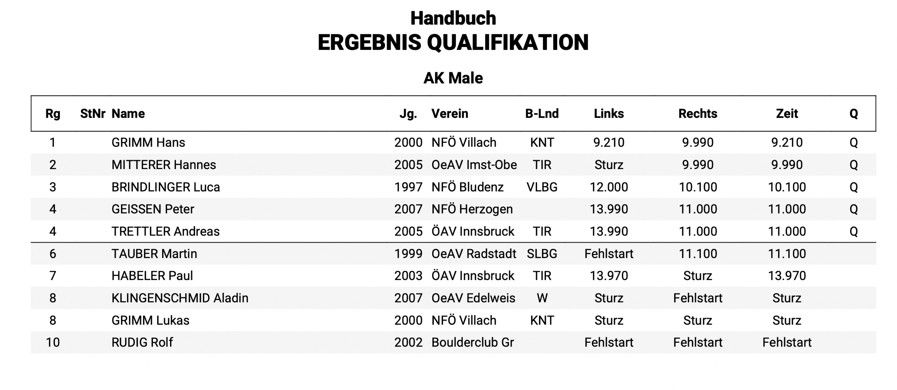

# Best-Of

Wie der IFSC-Weltcupqualifikationsmodus Speed.

* Athlet\*innen klettern zwei Routen&#x20;
* Kletterzeit pro Route wird als Wertung der jeweiligen Route eingetragen
* Zeitnehmung sollte auf 1/1000 genau sein, für die Wertung aber auf 1/100 abgerundet werden
* Verfehlen des Buzzers oder ein Sturz wird als „Sturz“ gewertet und so im System eingetragen
* Ein Fehlstart wird als „Fehlstart“ gewertet und so im System eingetragen

#### Auswertung

* Nur die Bessere der zwei Wertungen wird gezählt
* Athlet\*innen werden nach der schnellsten Zeit/Wertung gereiht
* Athlet\*innen mit einem Fehlstart (wenn kein Fehlstart erlaubt), werden ex-aequo als Letzter gereiht
* Wenn ein Fehlstart erlaubt ist, werden Athlet\*innen mit einem Fehlstart nach ihrer zweiten Wertung gereiht
* Athlet\*innen mit zwei Fehlstarts (wenn ein Fehlstart erlaubt ist), werden ex-aequo als Letzter gereiht
* Athlet\*innen ohne gültige Zeit (zB. 2 Stürze) werden ex-aequo hinter Athlet\*innen mit valider Zeit aber vor Athlete\*innen mit Fehlstart gereiht

#### Beispiele:&#x20;

Möglichen Wertungskombinationen und dessen Reihungen für einen „Best-Of“ Modus ohne Fehlstart sind in folgender Abbildung dargestellt.&#x20;

<figure><figcaption></figcaption></figure>

In Abbildung 22 findet man die möglichen Wertungskombinationen für den Modus „Best-Of“ mit einem erlaubtem Fehlstart.

<figure><figcaption></figcaption></figure>

Ergebnisse werden **live online** gezeigt

Alle Einstellungsmöglichkeiten sind auf folgender Page angegeben:


[speed.md](../../vorbereitung-zur-bewerbsdurchfuhrung/bewerbsklassen-einstellungen/speed.md)

