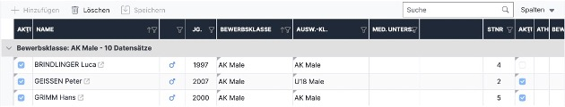

# Atlet\*innen hinzufügen/entfernen

Athlet\*innen können in der Auswertungsoberfläche im Register „Nennungen“ hinzugefügt (zB. Nachnennungen) und entfernt werden.&#x20;

## Athlet\*in hinzufügen&#x20;

Im Bereich **„Nennung hinzufügen“** (Abbildung Page "Nennliste"  rotes Kästchen 1) im Feld „Athlet“ den Namen eingeben und richtige/n Athlet\*in im Dropdown-Menü auswählen.\
&#xNAN;_&#x45;rscheint der / die Athlet\*in nicht im Dropdown-Menü ist er/sie noch nicht in der Datenbank angelegt und muss sich zuerst selbst unter_ [_data.austriaclimbing.com_](http://data.austriaclimbing.com/) _als Athlet\*in registrieren. Danach kann er/sie wie oben beschrieben hinzugefügt werden. Es wird davon abgeraten, dass Auswerter\*innen oder State Admins Personen selbst anlegen, um sie dem Bewerb hinzuzufügen. Jede Person muss auch einen User haben und dieser muss eigenhändig angelegt werden._

Die passende **Bewerbs- und Auswertungsklasse** wählen.

Auf den Button **„Nennung hinzufügen“** klicken.

Athlet\*in ist nun direkt im Bewerb und muss nicht noch zusätzlich, wie auf Page "Nennungen" in den Bewerb übernommen werden.

Sollten schon Startpositionen und Startnummern verlost worden sein muss dies entweder neu gemacht werden oder für den nachgenannten Athleten\*in händisch eingetragen werden. Siehe


[startliste.md](startliste.md)


&#x20;

## Athlet\*in entfernen

Es gibt zwei Arten eine/n Athlet\*in aus den Bewerb zu entfernen:

#### Inaktiv setzten:

* Mit Doppelklick auf blauen Haken in der rechten „Aktiv“-Spalte (Abbildung auf Page "Nennungen" rotes Kästchen 3 und 4) ist das Feld aktiviert
* Ein weiterer Klick lässt den blauen Haken verschwinden
* Klick irgendwo auf die Seite bestätigt die Auswahl, nun erscheint das Kästchen orange hinterlegt da es noch nicht gespeichert ist
* Klick auf „Speichern“, um die Auswahl zu speichern
* Inaktive Athlet\*innen werden in der Auswerteroberfläche noch in „Nennungen“ und „Startlisten“ aufgelistet, sind aber in den Listen und für den öffentlichen Nutzer nicht sichtbar

Im folgenden Beispiel ist Brindlinger Luca auf „Inaktiv“ gesetzt:

<figure><figcaption></figcaption></figure>

#### Löschen:

* Klick auf die Zeile des / der zu löschenden Athlet\*in
* Klick auf Button „Löschen“
* Nun blinkt der „Speichern“ Button orange, da die Änderung noch nicht gespeichert ist
* Klick auf „Speichern“ bestätigt die Löschung
* Athlet\*in ist nun nicht mehr sichtbar und aus dem Bewerb gelöscht, kann aber wieder hinzugefügt werden
