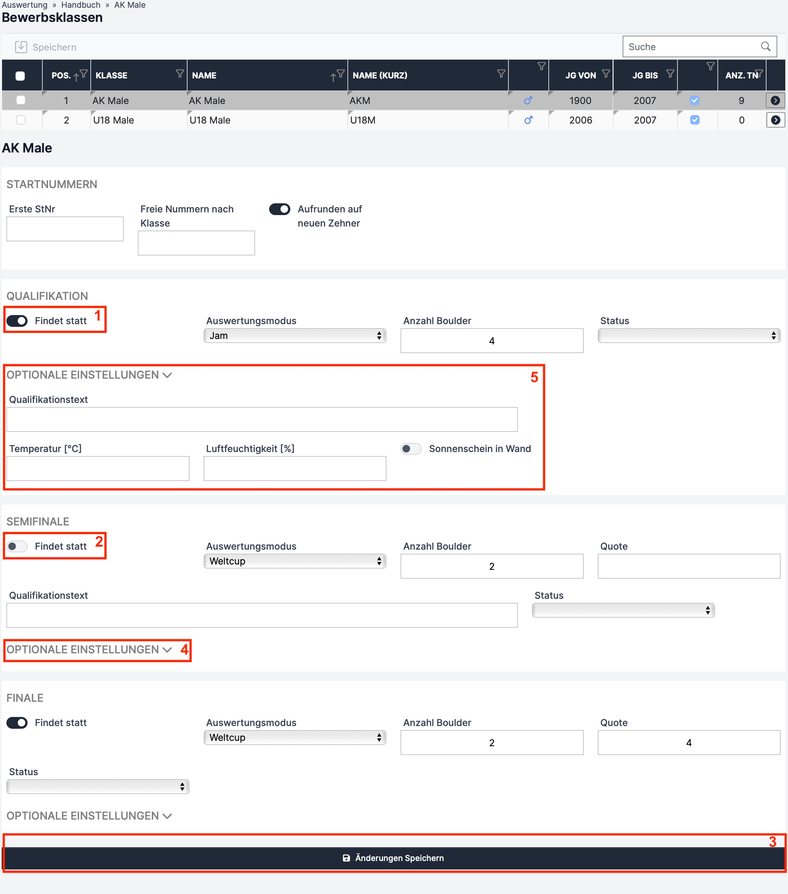

# Boulder

Die Einstellungsmöglichkeiten für einen Boulderbewerb sind in der folgenden Tabelle erklärt.&#x20;

<table data-full-width="false"><thead><tr><th width="213">Feld</th><th width="244">Funktion</th><th width="177">Mögliche Eingaben</th><th>Pflicht?</th></tr></thead><tbody><tr><td><strong>Findet statt</strong></td><td>Muss auf „ON“ gestellt werden, wenn die jeweilige Runde (Qualifikation, Semifinale, Finale) stattfindet</td><td>ON (rotes Kästchen 1) oder OFF (rotes Kästchen 2)</td><td>Pflicht</td></tr><tr><td><strong>Auswertungsmodus</strong></td><td>Im Dropdown den jeweiligen Bewerbsmodus pro Runde einstellen</td><td></td><td>Pflicht</td></tr><tr><td><strong>Durchführungsmodus</strong></td><td>Im Dropdown den jeweiligen Durchführungsmodus pro Runde einstellen.</td><td></td><td>Pflicht</td></tr><tr><td><strong>Anzahl Boulder</strong></td><td>Anzahl der Boulder der jeweiligen Runde</td><td>1 - ∞</td><td>Pflicht</td></tr><tr><td><strong>Anzahl Zonen</strong></td><td>Anzahl der Zonen pro Boulder in der jeweiligen Runde</td><td>0,1 oder 2</td><td>Pflicht</td></tr><tr><td><strong>Quote</strong></td><td>Anzahl der Athleten die in diese Runde aufsteigen</td><td>1 - ∞</td><td>Pflicht</td></tr><tr><td><strong>Qualifikationstext</strong></td><td></td><td></td><td>Optional</td></tr><tr><td><strong>Status</strong></td><td>Angabe, ob die jeweilige Runde gerade im Gange ist oder ob sie schon fertig ist.</td><td>„Leer“ (bevor die Runde startet), "läuft", "inoffizielles Ergebnis", "offizielles Ergebnis"</td><td>Pflicht</td></tr><tr><td><strong>Temperatur</strong></td><td>Für Coaches interessant</td><td></td><td>Optional</td></tr><tr><td><strong>Luftfeuchtigkeit</strong></td><td>Für Coaches interessant</td><td></td><td>Optional</td></tr><tr><td><strong>Sonnenschein in Wand</strong></td><td>Für Coaches interessant</td><td>ON oder OFF</td><td>Optional</td></tr></tbody></table>

Zusätzliche Einstelllungen, die für den Durchführungsmodus „Standard“ zu treffen sind, sind der folgenden Tabelle erklärt.

<table data-full-width="false"><thead><tr><th width="198">Feld</th><th width="244">Funktion</th><th width="177">Mögliche Eingaben</th><th>Pflicht?</th></tr></thead><tbody><tr><td><strong>Anzahl Startgruppen</strong></td><td>Anzahl der Startgruppen (ev. bei vielen Teilnehmer*innen nötig)</td><td>1,2</td><td>Pflicht</td></tr><tr><td><strong>Kletterzeit</strong></td><td>Kletterzeit pro Boulder</td><td>Zeit im Format hh:mm:ss</td><td>Optional</td></tr><tr><td><strong>Rotationszeit</strong></td><td>Zeit zwischen den Kletterperioden, für den Wechsel der Athlet*innen</td><td>Zeit im Format hh:mm:ss  (IFSC 2024: 00:00:15)</td><td>Optional</td></tr><tr><td><strong>Erste Startzeit</strong></td><td>Startzeit des ersten Athleten am ersten Boulder (zur Erstellung des Zeitplans aller Athlet*innen)</td><td>Uhrzeit im Format hh:mm</td><td>Optional</td></tr><tr><td><strong>Callzone-Rotationen</strong></td><td>Anzahl an Kletterperioden die der/die Athlet*in vor seinem ersten Start in der Call-Zone sein muss (zur Erstellung des Zeitplans aller Athleten)</td><td>1 - ∞</td><td>Optional</td></tr><tr><td><strong>Iso-Zonentext</strong></td><td></td><td></td><td>Optional</td></tr><tr><td><strong>Iso-Zone öffnet</strong></td><td>Uhrzeit der Isolationszonenöffnung </td><td>Uhrzeit im Format hh:mm</td><td>Optional</td></tr><tr><td><strong>Iso-Zone schließt</strong></td><td>Uhrzeit der Schließung der Isolationszone</td><td>Uhrzeit im Format hh:mm </td><td>Optional</td></tr></tbody></table>

Im Auswertungsmodus "Performance Based" gibt es zwei zusätzliche Einstellungen:

<table data-full-width="false"><thead><tr><th width="166">Feld</th><th width="207">Funktion</th><th width="282">Mögliche Eingaben</th><th>Pflicht?</th></tr></thead><tbody><tr><td><strong>Punkte pro Boulder</strong></td><td>Die Punkte der einzelnen Boulder, die auf alle Topkletternden Athleten*innen aufgeteilt werden</td><td>Haben alle Boulder dieselbe Punkteanzahl reicht eine Zahl. Haben die Boulder unterschiedliche Punkte müssen dieser der Bouldernummer entsprechend hintereinander eingetragen werden.</td><td>Pflicht</td></tr><tr><td><strong>Versuche zählen</strong></td><td>Bei ON werden die Athleten*innen bei gleicher Punktzahl nach Versuchen gereiht.</td><td>ON oder OFF</td><td>Pflicht</td></tr></tbody></table>

Im Auswertungsmodus "Punkte" gibt es weitere zusätzliche Einstellungen:

<table data-full-width="false"><thead><tr><th width="166">Feld</th><th width="207">Funktion</th><th width="227">Mögliche Eingaben</th><th>Pflicht?</th></tr></thead><tbody><tr><td><strong>Top Punkte</strong></td><td>Die Punkte die man für das Erreichen des Tops bekommt</td><td></td><td>Pflicht</td></tr><tr><td><strong>Zonenpunkte</strong></td><td>Die Punkte die man für das Erreichen der Zone bekommt</td><td></td><td>Pflicht</td></tr><tr><td><strong>Low Zone Punkte</strong></td><td>Die Punkte die man für das Erreichen der Low Zone bekommt</td><td>Dieses Feld erscheint nur bei der Auswahl von 2 Zonen</td><td>Pflicht bei 2 Zonen sonst Optional</td></tr><tr><td><strong>Punktabzug pro Versuch</strong></td><td>Die Anzahl an Punkte die pro Versuch abgezogen werden</td><td></td><td>Pflicht</td></tr></tbody></table>

Alle Änderungen werden erst mit Klick auf den **„Änderungen Speichern“** Button übernommen (Abbildung unten rotes Kästchen 3).&#x20;

Optionale Einstellungen öffnen sich mit Klick auf den Button **„Optionale Einstellungen“** (Abbildung unten rotes Kästchen 4). Die geöffneten optionalen Einstellungen sind in der Abbildung unten mit dem roten Kästchen 5 gekennzeichnet.

## Beispiel

Die Bewerbsklasse AK Male hat eine Qualifikation im Modus „Jam“ mit 8 Bouldern und 1 Zone. Es findet kein Semifinale statt. Das Finale findet mit den besten 4 Athleten der Qualifikationsrunde statt und wird wieder im „Jam“ Modus ausgetragen, jedoch nur mit 4 Bouldern.

<figure><figcaption>
Bewerbsklassen-Einstellungen Boulder
</figcaption></figure>
