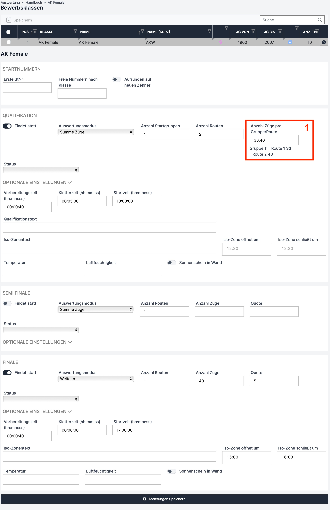

# Lead

Einstellungen sind für alle Bewerbsmodi gleich und sind in der folgenden Tabelle erklärt.

<table data-full-width="false"><thead><tr><th width="198">Feld</th><th width="244">Funktion</th><th width="177">Mögliche Eingaben</th><th>Pflicht?</th></tr></thead><tbody><tr><td><strong>Findet statt</strong></td><td>Muss auf „ON“ gestellt werden, wenn die jeweilige Runde (Qualifikation, Semifinale, Finale) stattfindet</td><td>ON oder OFF </td><td>Pflicht</td></tr><tr><td><strong>Auswertungsmodus</strong></td><td>Im Dropdown den jeweiligen Bewerbsmodus pro Runde einstellen</td><td></td><td>Pflicht</td></tr><tr><td><strong>Anzahl Startgruppen</strong></td><td>Angabe ob es mehrere Startgruppen gibt</td><td>1 ,2</td><td>Pflicht</td></tr><tr><td><strong>Anzahl Routen</strong></td><td>Anzahl der Routen der jeweiligen Runde</td><td>1 - ∞</td><td>Pflicht</td></tr><tr><td><strong>Anzahl Griffe pro Gruppe/Route</strong></td><td>Anzahl der Griffe jeder Route</td><td>Trennung der Routen durch Beistrich/Strichpunkt/Leezeichen (rotes Kästchen 1)</td><td>Pflicht</td></tr><tr><td><strong>Quote</strong></td><td>Anzahl der Athlet*innen die in diese Runde aufsteigen</td><td>1 - ∞</td><td>Pflicht</td></tr><tr><td><strong>Vorbereitungszeit</strong></td><td>Zeit die der/die Athlet*in von Betreten des "Field of Plays" zum Einstieg in die Route benötigen darg um sich vorzubereiten</td><td>Zeit im Format hh:mm:ss (IFSC 2024: 00:00:40)</td><td>Optional</td></tr><tr><td><strong>Kletterzeit</strong></td><td>Zeit die der/die Athlet*in in der Route sein darf</td><td>Zeit im Format hh:mm:ss</td><td>Optional (<em>aber für Timer in der Schiedsrichteroberfläche nötig)</em></td></tr><tr><td><strong>Qualifikationstext</strong></td><td></td><td></td><td>Optional</td></tr><tr><td><strong>Iso-Zonentext</strong></td><td></td><td></td><td>Optional</td></tr><tr><td><strong>Iso-Zone öffnet</strong></td><td>Uhrzeit der Isolationszonenöffnung</td><td>Uhrzeit im Format hh:mm</td><td>Optional</td></tr><tr><td><strong>Iso-Zone schließt</strong></td><td>Uhrzeit der Schließung der Isolationszone</td><td>Uhrzeit im Format hh:mm</td><td>Optional</td></tr><tr><td><strong>Status</strong></td><td>Angabe, ob die jeweilige Runde gerade im Gange ist oder ob sie schon fertig ist.</td><td>„Leer“ (bevor die Runde startet), "läuft", "inoffizielles Ergebnis", "offizielles Ergebnis"</td><td>Pflicht</td></tr><tr><td><strong>Temperatur</strong></td><td>Für Coaches interessant</td><td></td><td>Optional</td></tr><tr><td><strong>Luftfeuchtigkeit</strong></td><td>Für Coaches interessant</td><td></td><td>Optional</td></tr><tr><td><strong>Sonnenschein in Wand</strong></td><td>Für Coaches interessant</td><td>ON oder OFF</td><td>Optional</td></tr></tbody></table>

Änderungen werden erst mit Klick auf den **„Änderungen Speichern“** Button übernommen&#x20;

## Beispiel

Die Bewerbsklasse AK Female hat eine Qualifikation im Modus „Summe Griffe“ mit 2 Routen. Route 1 hat 33 Griffe und Route 2 40 Griffe. Die Vorbereitungszeit beträgt 40 Sekunden, Kletterzeit ist 5 Minuten und die Runde startet um 10 Uhr. Es findet kein Semifinale statt. Das Finale findet mit den besten 5 Athletinnen der Qualifikationsrunde statt und wird im „Weltcup“ Modus mit 1 Route ausgetragen. Die Kletterzeit ist dabei eine Minute länger als in der Qualifikation. Die Isolationszone öffnet um 15 Uhr und schließt um 16 Uhr.

<figure><figcaption>
Bewerbsklassen-Einstellungen Lead
</figcaption></figure>
