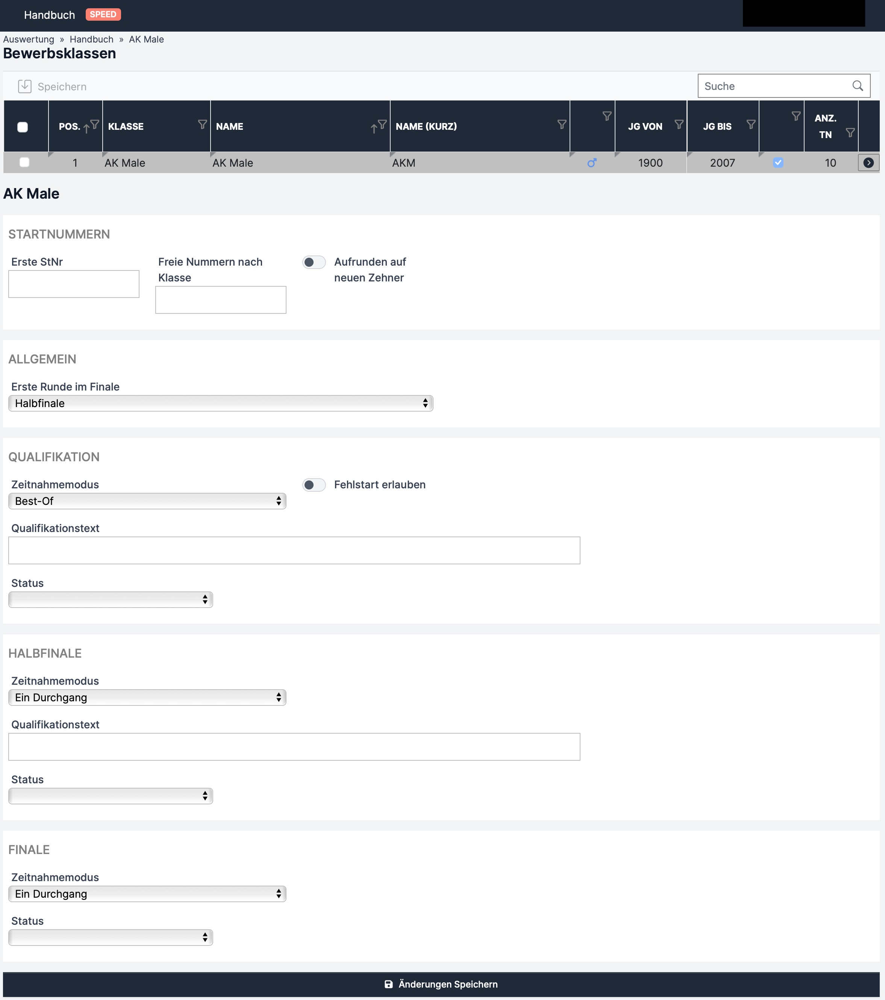

# Speed

Einstellungen sind für alle Bewerbsmodi gleich und sind in der folgenden Tabelle erklärt.

<table data-full-width="false"><thead><tr><th width="208">Feld</th><th width="244">Funktion</th><th width="166">Mögliche Eingaben</th><th>Pflicht?</th></tr></thead><tbody><tr><td><strong>Erste Runde im Finale</strong></td><td>Mit welcher Finalrunde das Finale gestartet wird (ergo die Finalquote)</td><td>"16er Finale", "Viertelfinale", "Halbfinale", "Finale"</td><td>Pflicht</td></tr><tr><td><strong>Zeitnehmungsmodus</strong></td><td>Im Dropdown den jeweiligen Bewerbsmodus pro Runde einstellen</td><td></td><td>Pflicht</td></tr><tr><td><strong>Fehlstart erlauben (nur in Quali möglich)</strong></td><td>Bei "ON" wird der Fehlstart wie ein Sturz gewertet. Bei "OFF" wird der/die Athlet*in, sobald er einen Fehlstart hat, automatisch als Letzter gereiht.</td><td>"ON" oder "OFF"</td><td>Pflicht</td></tr><tr><td><strong>Qualifikationstext</strong></td><td></td><td></td><td>Optional</td></tr><tr><td><strong>Status</strong></td><td>Angabe, ob die jeweilige Runde gerade im Gange ist oder ob sie schon fertig ist.</td><td>„Leer“ (bevor die Runde startet), "läuft", "inoffizielles Ergebnis", "offizielles Ergebnis"</td><td>Pflicht</td></tr></tbody></table>

Änderungen werden erst mit Klick auf den **„Änderungen Speichern“** Button übernommen.

## Beispiel

Die Bewerbsklasse AK Male hat eine Qualifikation im Modus „Best-Of“ und ein Fehlstart ist nicht erlaubt. Die erste Finalrunde ist das Halbfinale, somit kommen die 4 besten Athleten der Qualifikation in die Finalrunden die im Modus „Ein Durchgang“ ausgeführt werden.

<figure><figcaption>
Bewerbsklassen-Einstellungen Speed
</figcaption></figure>
