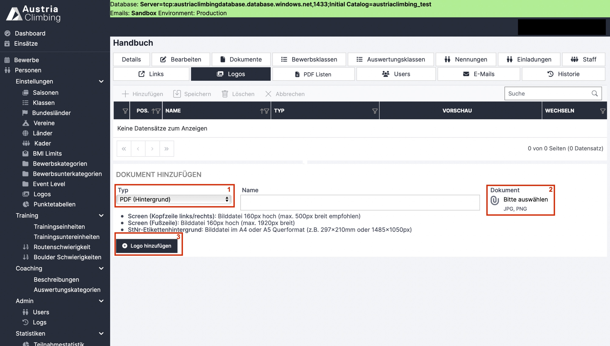

# Logos (Optional)

Logos und Hintergrundbilder können in der Adminoberfläche im Register „Logos“ in den Bewerb importiert werden.

<figure><figcaption>
Adminoberfläche Register "Logos"
</figcaption></figure>

* Im Dropdown-Menü **„Typ“** ( rotes Kästchen 1) wählt man den Logobereich aus. Möglich ist (Stand 02/2024):
  * PDF (Hintergrund)
  * PDF (Kopfzeile)
  * PDF (Fußzeile)
  * Screen (Kopfzeile links/rechts)
  * Screen (Fußzeile)
  * StNr-Etiketthintergrund

PDF bezieht sich dabei auf alle PDF-Downloads wie Start- & Ergebnislisten. Screen steht für die Liveergebnisscreen- bzw. Beameranzeige vor Ort (nicht auf der Website)&#x20;

* &#x20;Gewünschten Namen eingeben
* Auf das Symbol unter **„Dokument“** (rotes Kästchen 2) klicken, gewünschte Datei auswählen und auf **„Hochladen“** drücken. Nun wird rechts daneben die hochgeladene Datei angezeigt.
* Auf **„Logo hinzufügen“** (rotes Kästchen 3) klicken
* &#x20;Nun erscheint in der Tabelle das hinzugefügte Logo (folgende Abbildung)
* Um ein Logo zu löschen das entsprechende Logo in der Tabelle anklicken und somit markieren (es ist nun grau hinterlegt). Dann auf **Löschen** drücken (folgende Abbildung rotes Kästchen 1).

<figure><figcaption>
Logo hinzugefügt
</figcaption></figure>

Die Logos sind nun lediglich in den jeweiligen Bewerb importiert, um sie den passenden Positionen zuzuweisen muss das Register „PDF Listen“ ausgewählt werden.
