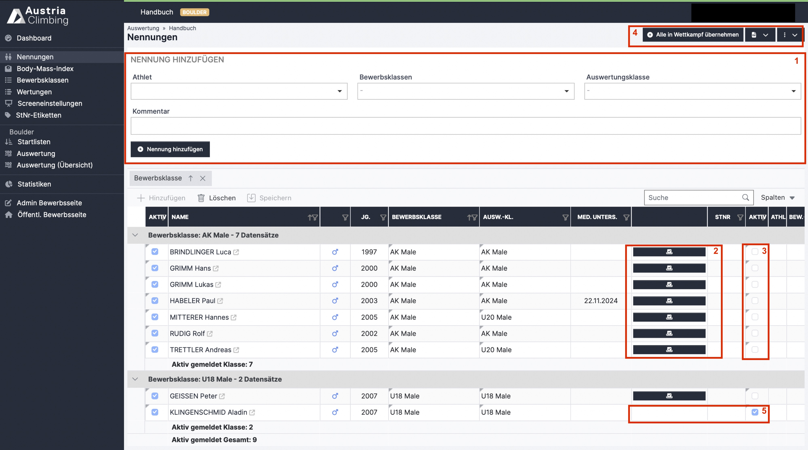

# Nennliste

Im Register „Nennungen“ der Auswerteroberfläche findet man die gemeldeten Athlet\*innen und kann diese bearbeiten.

<figure><figcaption>
Auswerteroberfläche Register Nennungen
</figcaption></figure>

In der Tabelle sind die gemeldeten Athlet\*innen in ihren jeweiligen Bewerbsklassen aufgelistet. Sie können aber auch nach anderen Spaltenüberschriften gruppiert werden. Dazu drückt man auf das „X“ neben Bewerbsklassen und zieht dann die gewünschte Spaltenüberschrift in das markierte Feld.

* Fehlende Nennungen können auch hier hinzugefügt werden (rotes Kästchen 1)
* **Athlet\*innen müssen in den Bewerb übernommen** werden, um Startlisten zu erstellen usw. Man kann sie einzeln über den dunkelblauen Button (rotes Kästchen 2) in der Zeile des jeweiligen Athleten / der jeweiligen Athletin in den Bewerb übernommen werden (speichern ist nicht nötig)
* Es können auch Athlet\*innen auf einmal über den Button **„Alle in Wettkampf übernehmen“** (rotes Kästchen 4) in den Bewerb übernommen werden
* Bei bereits übernommenen Athlet\*innen verschwindet in der Zeile des Athleten der Button zur Übernahme in den Bewerb, jedoch ist das Kästchen in der rechten „Aktiv“ Spalte mit einem blauen Haken gefüllt (rotes Kästchen 5)

Im Drop-Down Menü mit dem **PDF Symbol** (rotes Kästchen 4) können zwei Arten von Meldelisten als PDF heruntergeladen werden:

* Öffentliche Meldelisten: zum Veröffentlichen; beinhaltet nur Daten, die veröffentlicht werden können
* Interne Meldeliste: für die Registrierung; beinhaltet zusätzlich Informationen, wie die Information, ob bereits ein medizinisches Zertifikat der Person in der Datenbank hinterlegt ist bzw. wie lange dieses gültig ist

Die Interne Meldeliste kann zusätzlich noch als XLSX-Datei heruntergeladen werden. Darin befinden sich zusätzlich noch die Mail Adressen aller gemeldeten Personen.

Im Drop-Down Menü mit den drei Punkten (rotes Kästchen 4) gibt es folgende Möglichkeiten:

* Startnummern importieren: Importieren der Startnummern vom alten KVÖ System
* Klassen neu zuweisen und von Stammdaten aktualisieren: Athleten werden nochmals im System aktualisiert und automatisch der Jahrgangsentsprechenden Klasse zugewiesen
* **Nennungen exportieren:** Die Nennliste wird als XLSX-Datei exportiert
* **Nennungen importieren:** Die Nennliste kann als XLSX-Datei von einem anderen Bewerbs der Austria Climbing Datenbank (oder im selben Format) importiert werden

### Personendaten ändern

Sollte es nötig sein dass die Personendaten geändert werden müssen ist in zwei Varianten möglich:

* &#x20;**Nur für den jeweiligen Bewerb:** In der Tabelle können die Zellen der Spalten "Vorname" und "Nachname" bearbeitet werden und somit der Name des Athleten / der Athletin geändert werden. Diese Änderung ist nur für den geöffneten Bewerb gültig.
* **Allgemein gültige Änderung:** In der Tabelle ist ganz rechts die jeweilige verknüpfte Person zum/r angemeldeten Athlet\*in angegeben. Mit Klick auf den Pfeil öffnet sich das entsprechende Personendatenblatt und die Änderungen (wie zB. Jahrgang) können vorgenommen werden.

Wie ein Athlet\*in gelöscht werden kann wird hier erklärt:


[atlet-innen-hinzufugen-entfernen.md](../atlet-innen-hinzufugen-entfernen.md)


Wie die Bewerbs- und/oder Auswertungsklasse geändert wird ist auf der folgenden Page beschrieben.
