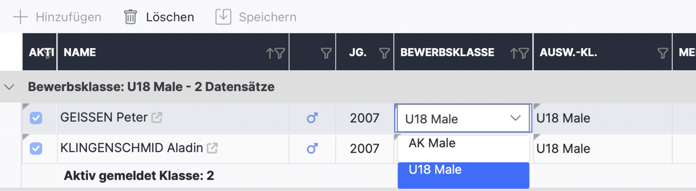
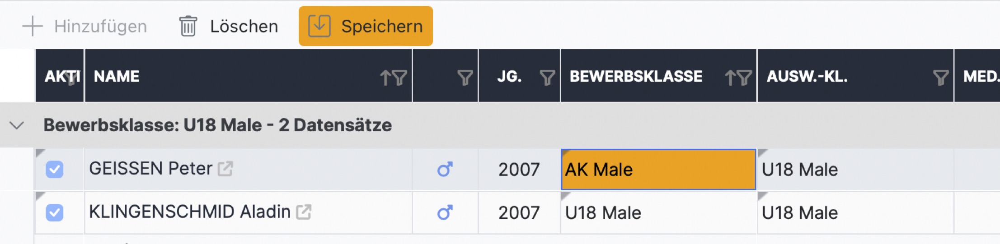
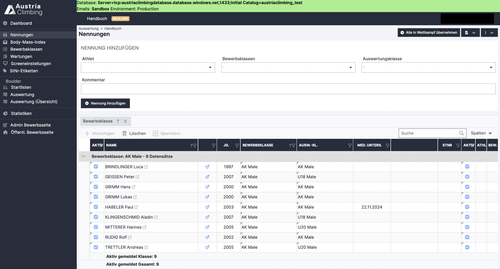

# Bewerbs- und Auswertungsklasse wechseln

Um die Bewerbsklasse eines/einer Athlet\*in zu ändern muss man in der Zeile des/der Athlet\*in, mit Doppelklick auf das Zellenelement der Spalte „Bewerbsklasse“, das Dropdown-Menü aktivieren und mit einem weiteren Klick auf den Pfeil das Dropdown-Menü öffnen. Es werden nun die, in der Adminoberfläche bereits angelegten, Bewerbsklassen angezeigt.

<figure><figcaption></figcaption></figure>

Nun die neue Bewerbsklasse auswählen und, um die Auswahl zu bestätigen, irgendwohin auf die Seite klicken.&#x20;

Noch nicht gespeicherte Änderungen sind orange hinterlegt. Speichern ist nötig, um die Änderungen zu übernehmen.

<figure><figcaption></figcaption></figure>

Der Wechsel der Auswertungklasse erfolgt nach demselben Prinzip.

## Beispiel

In der Abbildung der vorherigen Page ist erkennbar, dass nur zwei Athleten in der Bewerbsklasse U18 Männlich angemeldet sind. Man möchte deshalb die zwei Athleten gemeinsam mit der AK Männlich starten lassen und somit die Bewerbsklassen zusammenlegen. Um die Klassen zusammenzulegen wechselt man bei beiden U18 Athleten die Bewerbsklasse auf AK Männlich. Das Ergebnis ist in der folgenden Abbildung dargestellt. Die separate Wertung für U18 Männlich ist durch den Erhalt der Auswertungsklasse als „U18 Männlich! später unter „Wertungen“ noch immer möglich.

<figure><figcaption>
Beispiel: Klassen zusammenlegen
</figcaption></figure>
