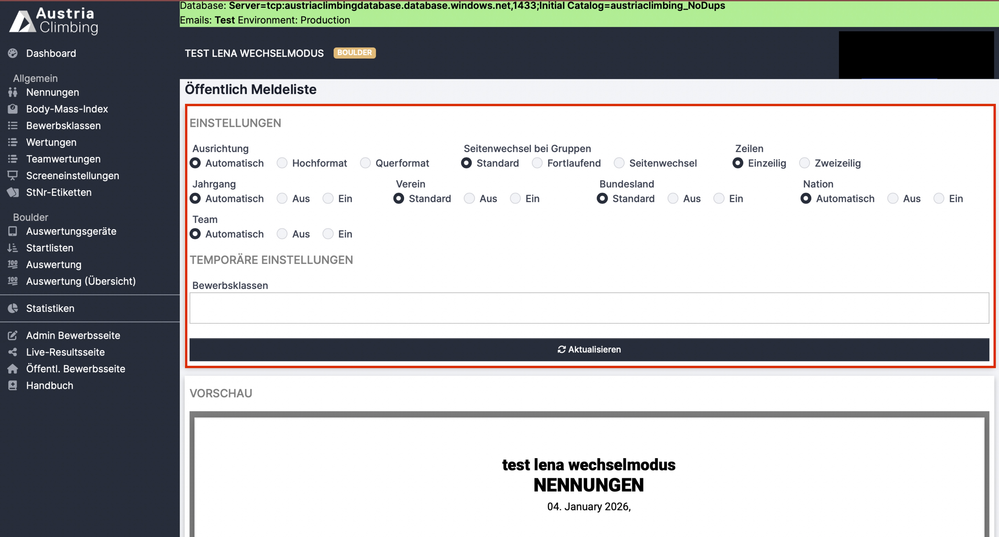

# PDF Bearbeitungen

Bei allen PDF's die man in der Software öffnen kann wird man zuerst zu einer PDF-Bearbeitungsdarstellung weitergeleitet.&#x20;

<figure><figcaption></figcaption></figure>

In dieser Ansicht kann man einige Einstellungen (rotes Kästchen) treffen die die PDF Darstellung verändert.  Es können auch einzelne Bewerbsklassen ausgewählt werden. Wichtig: Auf Aktualisieren klicken damit die Einstellungen auch wirklich übernommen werden.

Die Default-Werte sind im obrigen Foto dargestellt.
