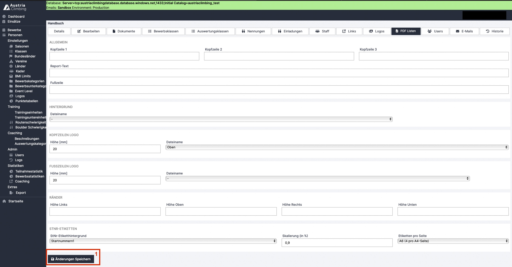

# PDF Listen (Optional)

Im Register „PDF Listen“ in der Adminoberfläche können optionale Einstellungen an den PDF-Ausdrucken und Startnummern vorgenommen werden.

<figure><figcaption>
Adminoberfläche Register "PDF Listen"
</figcaption></figure>

### Allgemein

* Kopfzeilen 1,2 und 3: Text für die Kopfzeile, wobei die Anordnung übereinander ist. Kopfzeile 1 steht somit über Kopfzeile 2 und die über Kopfzeile 3
* Report-Text
* Fußzeile: Text für die Fußzeile&#x20;

### &#x20;Hintergrund

* &#x20;Im Dropdown-Menü erscheint unter anderem die in „Logos“ hochgeladene PDF(Hintergrund) Datei. Das „-“ Symbol bedeutet „kein Hintergrund“ und ist als Default eingestellt&#x20;

### Kopfzeilen Logo

* wie bei „Hintergrund“ findet man die hochgeladene PDF(Kopfzeile) Date im Dropdown-Menü.

### Fußzeilen Logo

* wie Kopfzeilen Logo

### Ränder

* Seitenränder können eingestellt werden. Lässt man die Felder leer werden Default-Werte angenommen

### StNr-Etiketten:&#x20;

* Im Dropdown-Menü entsprechenden Hintergrund auswählen
* Skalierung: Größe der Nummer und Namen kann dem Hintergrund angepasst werden
* Etiketten pro Seite: Einstellung wie groß die Startnummernetiketten sein sollen

Nur mit Klick auf „Änderungen speichern“ (rotes Kästchen 1) werden die Einstellungen übernommen
