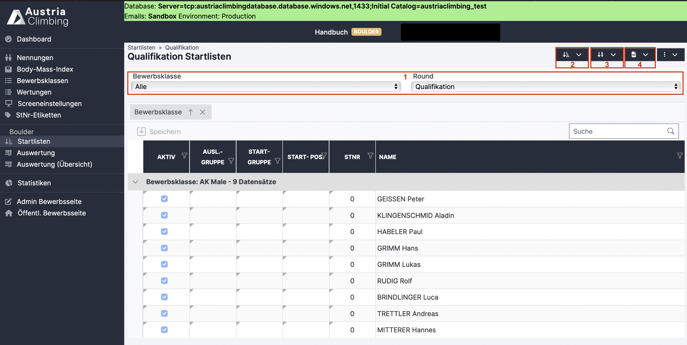
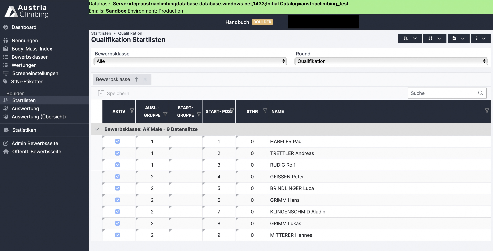
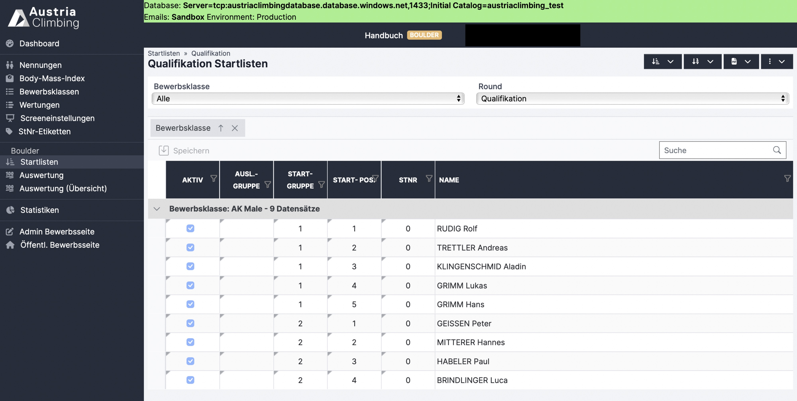

# Startliste

Im Register „Startlisten“ kann die Startreihenfolge/Startpositionen und die Startnummern festgelegt werden und verschiedenen Startlisten heruntergeladen werden.

<figure><figcaption>
Auswertungsoberfläche Register Startnummern
</figcaption></figure>

Im Dropdown (rotes Kästchen 1) die **passende Runde und Bewerbsklasse auswählen**. Bei einem Leadbewerb muss zusätzlich noch die Route ausgewählt werden, bei einem Speedbewerb der Durchgang (sollte es mehr als einen Durchgang geben).

Über das Dropdown-Menü mit den drei Punkten können die Live Results (bzw. Startposition und -nummer) gesendet werden.&#x20;

### Startreihenfolge verlosen

* Button mit den drei Linien anklicken (rotes Kästchen 2)
* „Zufällig“ oder „Nach StNr“ (nach Startnummer) wählen
* Es erscheint eine Warnung um unabsichtliches überschreiben zu vermeiden, mit einem weiteren Bestätigen der Startreihenfolgeverlosung wird der Prozess ausgeführt
* **Lead:** Startreihenfolge muss für jede Route verlost werden. Bei jeder weiteren Route gibt es zusätzlich noch die Option „50% gestaffelt“, dabei wird (nach IFSC Rules) die Startreihenfolge der vorherigen Route als Referenz genommen, in der Hälfte geteilt und die erste Hälfte hinten angehängt
* **Boulder & Lead:** Für jede Disziplin muss die Startreihenfolge extra verlost werden. Bei Vorstieg gibt es jedoch die Option „Gleich wie Boulder“
* **Speed:** Bei zwei Durchgängen muss die Startreihenfolge für jeden Durchgang verlost werden. Bei dem Durchgang „Links“ kann „Zufällig“ oder „Nach StNr“ verlost werden, bei dem Durchgang „Rechts“ gibt es zusätzlich die Option „50% gestaffelt“. Dabei wird die Startreihenfolge des Durchgangs „Links“ als Referenz genommen, in der Hälfte geteilt und die erste Hälfte hinten angehängt (so entstehen die Paarungen).

### Startnummern verlosen

* Button mit den Zahlen anklicken (rotes Kästchen 3)
* „Nach Startpositionen“ auswählen
* Bei aufkommender Warnung bestätigen, dass neue Startnummern verlost werden sollen
* Startnummern werden, im Gegensatz zur Startreihenfolge, für alle Routen (Lead/Speed) und Einzeldisziplinen (Boulder\&Lead) automatisch übernommen
* Startpositionen und/oder Startnummern können auch durch Doppelklick in die jeweilige Zelle und anschließendem Speichern einzeln den Athlet\*innen zugewiesen werden.
* Startreihenfolge und/oder Startnummern können für alle Athlet\*innen gelöscht werden. Dazu den Button für Startposition oder Startnummern anklicken und „Löschen“ auswählen.&#x20;

### PDF Listen

Die verschiedensten Downloadoptionen sind im Dropdown-Menü des PDF-Logos zu finden (rotes Kästchen 4).

* Startliste Durchgang: Startliste für die im linken Dropdown (rotes Kästchen 1) ausgewählte Runde und in Lead auch Route. Als PDF- oder XLSX-Datei möglich
* Judges Liste: Startliste mit Feldern für die Aufzeichnung der Schiedsrichter\*innen
* Laufzettel
* Call Times (Boulder): Startliste mit Callzeit und Startzeit für Boulder 1
* Wechselmodus Startzeiten (Boulder): Startliste mit Athlet pro Boulder pro Rotation für den Wechselmodus bzw. auch bekannt als „Chaosmodus“ (funktioniert mittlerweile auch für jede Anzahl an Athlet\*innen).
* Judge Form Wechselmodus (Boulder): Judge Liste in der Reihenfolge entsprechen des Wechselmodus/Chaosmodus
* Startliste nach Heads (Speed): Startliste in den Paarungen für die zwei Speeddurchgänge&#x20;
* Raster (Knockout – Speed): Startliste nach Paarungen aller Knockout Runden&#x20;

### Auslosungsgruppen (optional)

In der Spalte "Auslosungsgruppen" können die Athleten\*innen bestimmten Auslosungsgruppen zugeordnet werden (mit Zahlen 1,2,3…).

* Doppelklick auf das passende Zellenelement, die Zahl der Auslosungsgruppe eintragen und über den „Speichern“ Button speichern
* Mit Klick auf „Startreihenfolge zufällig“ (rotes Kästchen 2) wird die Startreihenfolge dann innerhalb der Athlet\*innen derselben Auslosungsgruppe zufällig verlost
* Auslosungsgruppen werden entsprechend der Auslosungsgruppenziffer hintereinander angeordnet und die Startpositionen werden durchnummeriert
* Auslosungsgruppen sind nur in der Auswertungsoberfläche sichtbar und werden auf keinen Listen angegeben

#### Beispiel:&#x20;

Die Nationalteamathleten Habeler, Rudig und Trettler sollen zu Beginn starten da es kein Vorklettern gibt (die Reihenfolge unter ihnen soll aber zufällig sein). Nach ihnen sollen alle anderen Athleten in zufälliger Reihenfolge starten. Die Nationalteamathleten werden deswegen der Auslosungsgruppe „1“ zugeordnet, alle anderen Athleten der Auslosungsgruppe „2“.

<figure><figcaption>
Beispiel Auslosungsgruppen
</figcaption></figure>

### Startgruppe (optional)

In der Spalte "Startgruppe" können die Athlet\*innen der Startgruppe 1 oder 2 zugeordnet werden, bei nur einer Startgruppe kann die Spalte leer bleiben

* Zwei Startgruppen bedeutet die Unterteilung der Athlet\*innen in zwei unterschiedliche Untergruppen einer Klasse und Runde. Athlet\*innen einer Startgruppe haben dabei dieselben Routen/Boulder, Athlet\*innen unterschiedlicher Startgruppen jedoch nicht. Gereiht wird innerhalb der Startgruppe und dieser Rang wird dann in das gemeinsame Ergebnis übernommen. Es gibt also zwei Erste, zwei Dritte, zwei Fünfte… (Eher im Weltcup bei vielen Startern in Verwendung)
* In „Bewerbsklassen“ muss im Feld „Anzahl Startgruppen“ „2“ stehen, um hier zwei Startgruppen zu verwenden
* Doppelklick auf das passende Zellenelement, die Ziffer der Startgruppe eintragen und über den „Speichern“ Button speichern
* Mit Klick auf „Startreihenfolge zufällig“ (Abbildung 17 rotes Kästchen 2) wird die Startreihenfolge dann innerhalb der Athlet\*innen derselben Startgruppe zufällig verlost. Es gibt zwei getrennte Startreihenfolgen, einmal für Startgruppe 1, einmal für Startgruppe 2
* Startgruppen sind in allen PDF-Downloads angegeben

#### Beispiel:

&#x20;Man möchte die Qualifikation mit zwei getrennten Startgruppen durchführen. Die Startpositionen nehmen innerhalb der Startgruppe die Werte von 1-x an. Die Startpositionen in der zweiten Startgruppe beginnen wieder mit 1. Die Startnummern bleiben aber natürlich individuell pro Athlet\*in.

<figure><figcaption>
Beispiel Startgruppen
</figcaption></figure>

