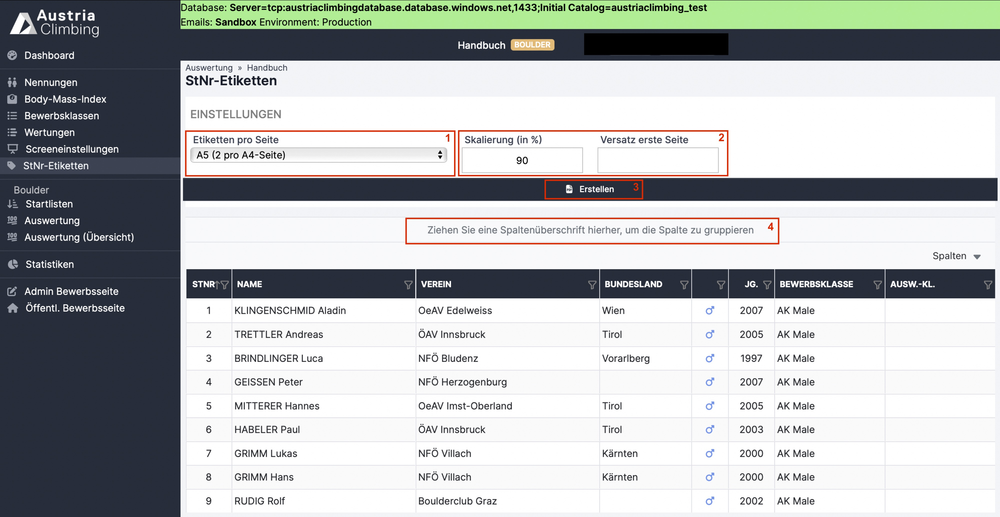

# Startnummern-Etiketten

Im Register „StNr-Etiketten“ der Auswertungsoberfläche kann die Druckvorlage der Startnummern erstellt werden.

<figure><figcaption>
Auswerteroberfläche Register "StNr-Etiketten"
</figcaption></figure>

Im Dropdown-Menü **„Etiketten pro Seite“** (rotes Kästchen 1) kann man einstellen, wie groß die Startnummern Etiketten sein sollen.

Im Fenster **„Skalierung“** (rotes Kästchen 2) kann die Größe des Texts (Startnummern, Name, Verein, Bundesland & Bewerbsklasse) verändert und somit dem Hintergrund angepasst werden.

Möchte man die Athlet\*innen für das PDF der Startnummern-Etiketten anders als nach Startnummer sortieren bzw. gruppieren muss die entsprechende Spaltenüberschrift in das dafür vorhergesehene Feld (rotes Kästchen 4) gezogen werden. Zum Beispiel wenn man sie alphabethisch nach Namen, oder gesammelt für einen Verein sortiert haben möchte.

Möchte man die Startnummern-Etiketten einzelner Athlet\*innen erstellen kann man diese per Klick auswählen (diese werden dann grau hinterlegt in der Tabelle angezeigt). Möchte man so mehrere Athlet\*innen auswählen muss während dem Anklicken dieser die STRG- bzw. command-Taste gedrückt werden.

Mit dem **„Erstellen“** Button (rotes Kästchen 3) wird ein PDF der Startnummern-Etiketten entsprechend den Einstellungen erstellt.

**Hintergrundlogo** der Startnummern-Etiketten muss in der Adminoberfläche im Register „Logos“ hochgeladen werden und im Register „PDF Listen“ den StNr-Etiketten zugeordnet werden.
